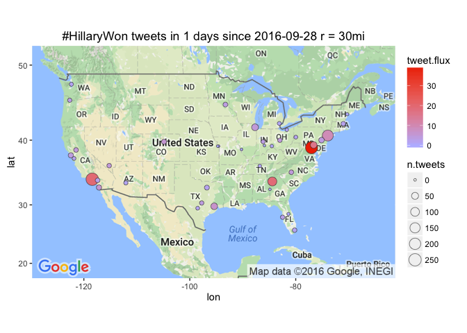

# Leading Metro Areas with #HillaryWon tweet flux
Winston Saunders  
September 23, 2016  

# setup


```r
## set up search terms
searchString.x <- "#HillaryWon"    # search term
n.x <- 3000                     # number of tweets
radius <- "30mi"               # radius around selected geo-location
duration.days <- 1             # how many days
since.date <- (Sys.Date() - duration.days) %>% as.character # calculated starting date
```

# #HillaryWon geo-preference.


```
[1] "Using direct authentication"
```


Get city geo data from `maps::cities`


Use the `twitteR::searchTwitter` command. 


```r
n.cities <- 40
```

Data collection for the top 40 cities (by population) in the U.S. This includes cities from New York to Nashville.


# Tweet-Map for #HillaryWon?


```r
map.plot +
    geom_point(aes(x = lon, y = lat, fill = tweet.flux, size = n.tweets), data=analyzed_df, pch=21, color = "#33333399") +
    ggtitle(paste0(searchString.x, " tweets in ", duration.days," days since ", since.date, " r = ", radius)) +
    scale_fill_gradient(low = "#BBBBFF", high = "#EE3300", space = "Lab", na.value = "grey50", guide = "colourbar")
```




## #HillaryWon AMB tweet-flux

Here are the top few cities by tweet flux (in "twipermipeds").

<!-- html table generated in R 3.3.0 by xtable 1.8-2 package -->
<!--  -->
<table border=1>
<tr> <th> name </th> <th> tweet.flux </th> <th> n.tweets </th> <th> population </th>  </tr>
  <tr> <td> Washington </td> <td align="right"> 39.20 </td> <td align="right"> 239 </td> <td align="right"> 6097684 </td> </tr>
  <tr> <td> Los Angeles </td> <td align="right"> 19.42 </td> <td align="right"> 259 </td> <td align="right"> 13340068 </td> </tr>
  <tr> <td> Atlanta </td> <td align="right"> 18.74 </td> <td align="right"> 107 </td> <td align="right"> 5710795 </td> </tr>
  <tr> <td> Baltimore </td> <td align="right"> 15.73 </td> <td align="right">  44 </td> <td align="right"> 2797407 </td> </tr>
  <tr> <td> New York </td> <td align="right"> 9.17 </td> <td align="right"> 185 </td> <td align="right"> 20182305 </td> </tr>
  <tr> <td> Houston </td> <td align="right"> 6.61 </td> <td align="right">  44 </td> <td align="right"> 6656947 </td> </tr>
  <tr> <td> San Diego </td> <td align="right"> 5.76 </td> <td align="right">  19 </td> <td align="right"> 3299521 </td> </tr>
  <tr> <td> Denver </td> <td align="right"> 5.69 </td> <td align="right">  16 </td> <td align="right"> 2814330 </td> </tr>
  <tr> <td> Chicago </td> <td align="right"> 4.92 </td> <td align="right">  47 </td> <td align="right"> 9551031 </td> </tr>
  <tr> <td> Sacramento </td> <td align="right"> 4.84 </td> <td align="right">  11 </td> <td align="right"> 2274194 </td> </tr>
  <tr> <td> Las Vegas </td> <td align="right"> 4.73 </td> <td align="right">  10 </td> <td align="right"> 2114801 </td> </tr>
  <tr> <td> Charlotte </td> <td align="right"> 4.53 </td> <td align="right">  11 </td> <td align="right"> 2426363 </td> </tr>
  <tr> <td> Columbus </td> <td align="right"> 4.45 </td> <td align="right">   9 </td> <td align="right"> 2021632 </td> </tr>
  <tr> <td> Austin </td> <td align="right"> 4.00 </td> <td align="right">   8 </td> <td align="right"> 2000860 </td> </tr>
  <tr> <td> San Francisco </td> <td align="right"> 3.87 </td> <td align="right">  18 </td> <td align="right"> 4656132 </td> </tr>
   </table>

## #HillaryWon AMB tweet count

Here are the top few cities sorted by raw tweets, again with major metro areas leading. Note that some other cities, like Chicago, have a large number of tweets but a lower flux because of their higher population.

<!-- html table generated in R 3.3.0 by xtable 1.8-2 package -->
<!--  -->
<table border=1>
<tr> <th> name </th> <th> tweet.flux </th> <th> n.tweets </th> <th> population </th>  </tr>
  <tr> <td> Los Angeles </td> <td align="right"> 19.42 </td> <td align="right"> 259 </td> <td align="right"> 13340068 </td> </tr>
  <tr> <td> Washington </td> <td align="right"> 39.20 </td> <td align="right"> 239 </td> <td align="right"> 6097684 </td> </tr>
  <tr> <td> New York </td> <td align="right"> 9.17 </td> <td align="right"> 185 </td> <td align="right"> 20182305 </td> </tr>
  <tr> <td> Atlanta </td> <td align="right"> 18.74 </td> <td align="right"> 107 </td> <td align="right"> 5710795 </td> </tr>
  <tr> <td> Chicago </td> <td align="right"> 4.92 </td> <td align="right">  47 </td> <td align="right"> 9551031 </td> </tr>
  <tr> <td> Houston </td> <td align="right"> 6.61 </td> <td align="right">  44 </td> <td align="right"> 6656947 </td> </tr>
  <tr> <td> Baltimore </td> <td align="right"> 15.73 </td> <td align="right">  44 </td> <td align="right"> 2797407 </td> </tr>
  <tr> <td> Philadelphia </td> <td align="right"> 3.79 </td> <td align="right">  23 </td> <td align="right"> 6069875 </td> </tr>
  <tr> <td> San Diego </td> <td align="right"> 5.76 </td> <td align="right">  19 </td> <td align="right"> 3299521 </td> </tr>
  <tr> <td> San Francisco </td> <td align="right"> 3.87 </td> <td align="right">  18 </td> <td align="right"> 4656132 </td> </tr>
  <tr> <td> Denver </td> <td align="right"> 5.69 </td> <td align="right">  16 </td> <td align="right"> 2814330 </td> </tr>
  <tr> <td> Dallas </td> <td align="right"> 1.97 </td> <td align="right">  14 </td> <td align="right"> 7102796 </td> </tr>
  <tr> <td> Minneapolis </td> <td align="right"> 3.69 </td> <td align="right">  13 </td> <td align="right"> 3524583 </td> </tr>
  <tr> <td> Boston </td> <td align="right"> 2.30 </td> <td align="right">  11 </td> <td align="right"> 4774321 </td> </tr>
  <tr> <td> Riverside </td> <td align="right"> 2.45 </td> <td align="right">  11 </td> <td align="right"> 4489159 </td> </tr>
   </table>

  
  


