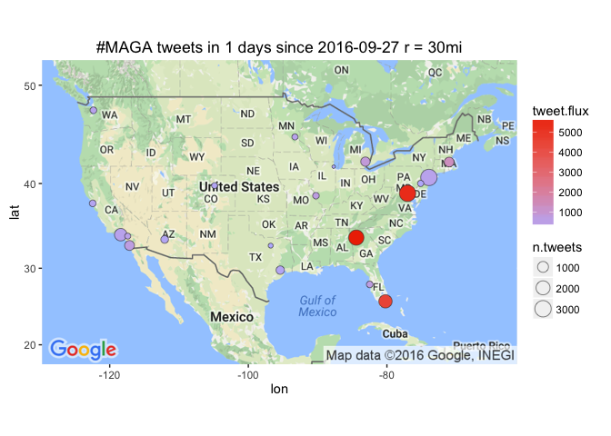

# Leading Metro Areas with #MAGA tweet flux
Winston Saunders  
September 23, 2016  

# setup


```r
## set up search terms
searchString.x <- "#MAGA"    # search term
n.x <- 3000                     # number of tweets
radius <- "30mi"               # radius around selected geo-location
duration.days <- 1             # how many days
since.date <- (Sys.Date() - duration.days) %>% as.character # calculated starting date
```

# #MAGA geo-preference.


```
[1] "Using direct authentication"
```


Get city geo data from `maps::cities`


Use the `twitteR::searchTwitter` command. 


```r
n.cities <- 20
```

Data collection for the top 20 cities (by population) in the U.S. This includes cities from New York NY to Saint Louis MO.


# Tweet-Map for #MAGA?


```r
map.plot +
    geom_point(aes(x = lon, y = lat, fill = tweet.flux, size = n.tweets), data=analyzed_df, pch=21, color = "#33333399") +
    ggtitle(paste0(searchString.x, " tweets in ", duration.days," days since ", since.date, " r = ", radius)) +
    scale_fill_gradient(low = "#BBBBFF", high = "#EE3300", space = "Lab", na.value = "grey50", guide = "colourbar")
```




## #MAGA AMB tweet-flux

Here are the top few cities by tweet flux (in "twipermipeds").

<!-- html table generated in R 3.3.0 by xtable 1.8-2 package -->
<!--  -->
<table border=1>
<tr> <th> name </th> <th> tweet.flux </th> <th> n.tweets </th> <th> population </th>  </tr>
  <tr> <td> Atlanta GA </td> <td align="right"> 5939.69 </td> <td align="right"> 2519 </td> <td align="right"> 424096 </td> </tr>
  <tr> <td> WASHINGTON DC </td> <td align="right"> 5470.87 </td> <td align="right"> 3000 </td> <td align="right"> 548359 </td> </tr>
  <tr> <td> Miami FL </td> <td align="right"> 4563.79 </td> <td align="right"> 1765 </td> <td align="right"> 386740 </td> </tr>
  <tr> <td> Boston MA </td> <td align="right"> 1255.81 </td> <td align="right"> 713 </td> <td align="right"> 567759 </td> </tr>
  <tr> <td> Detroit MI </td> <td align="right"> 724.95 </td> <td align="right"> 632 </td> <td align="right"> 871789 </td> </tr>
  <tr> <td> Tampa FL </td> <td align="right"> 572.16 </td> <td align="right"> 188 </td> <td align="right"> 328578 </td> </tr>
  <tr> <td> Saint Louis MO </td> <td align="right"> 570.44 </td> <td align="right"> 180 </td> <td align="right"> 315546 </td> </tr>
  <tr> <td> San Diego CA </td> <td align="right"> 569.51 </td> <td align="right"> 740 </td> <td align="right"> 1299352 </td> </tr>
  <tr> <td> Riverside CA </td> <td align="right"> 414.56 </td> <td align="right"> 127 </td> <td align="right"> 306351 </td> </tr>
  <tr> <td> Los Angeles CA </td> <td align="right"> 377.86 </td> <td align="right"> 1478 </td> <td align="right"> 3911500 </td> </tr>
  <tr> <td> New York NY </td> <td align="right"> 369.26 </td> <td align="right"> 3000 </td> <td align="right"> 8124427 </td> </tr>
  <tr> <td> Minneapolis MN </td> <td align="right"> 361.92 </td> <td align="right"> 132 </td> <td align="right"> 364726 </td> </tr>
  <tr> <td> Seattle WA </td> <td align="right"> 340.09 </td> <td align="right"> 194 </td> <td align="right"> 570430 </td> </tr>
  <tr> <td> San Francisco CA </td> <td align="right"> 273.58 </td> <td align="right"> 198 </td> <td align="right"> 723724 </td> </tr>
  <tr> <td> Phoenix AZ </td> <td align="right"> 227.45 </td> <td align="right"> 330 </td> <td align="right"> 1450884 </td> </tr>
   </table>

## #MAGA AMB tweet count

Here are the top few cities sorted by raw tweets, again with major metro areas leading. Note that some other cities, like Chicago, have a large number of tweets but a lower flux because of their higher population.

<!-- html table generated in R 3.3.0 by xtable 1.8-2 package -->
<!--  -->
<table border=1>
<tr> <th> name </th> <th> tweet.flux </th> <th> n.tweets </th> <th> population </th>  </tr>
  <tr> <td> New York NY </td> <td align="right"> 369.26 </td> <td align="right"> 3000 </td> <td align="right"> 8124427 </td> </tr>
  <tr> <td> WASHINGTON DC </td> <td align="right"> 5470.87 </td> <td align="right"> 3000 </td> <td align="right"> 548359 </td> </tr>
  <tr> <td> Atlanta GA </td> <td align="right"> 5939.69 </td> <td align="right"> 2519 </td> <td align="right"> 424096 </td> </tr>
  <tr> <td> Miami FL </td> <td align="right"> 4563.79 </td> <td align="right"> 1765 </td> <td align="right"> 386740 </td> </tr>
  <tr> <td> Los Angeles CA </td> <td align="right"> 377.86 </td> <td align="right"> 1478 </td> <td align="right"> 3911500 </td> </tr>
  <tr> <td> San Diego CA </td> <td align="right"> 569.51 </td> <td align="right"> 740 </td> <td align="right"> 1299352 </td> </tr>
  <tr> <td> Boston MA </td> <td align="right"> 1255.81 </td> <td align="right"> 713 </td> <td align="right"> 567759 </td> </tr>
  <tr> <td> Detroit MI </td> <td align="right"> 724.95 </td> <td align="right"> 632 </td> <td align="right"> 871789 </td> </tr>
  <tr> <td> Houston TX </td> <td align="right"> 217.82 </td> <td align="right"> 445 </td> <td align="right"> 2043005 </td> </tr>
  <tr> <td> Phoenix AZ </td> <td align="right"> 227.45 </td> <td align="right"> 330 </td> <td align="right"> 1450884 </td> </tr>
  <tr> <td> San Francisco CA </td> <td align="right"> 273.58 </td> <td align="right"> 198 </td> <td align="right"> 723724 </td> </tr>
  <tr> <td> Seattle WA </td> <td align="right"> 340.09 </td> <td align="right"> 194 </td> <td align="right"> 570430 </td> </tr>
  <tr> <td> Tampa FL </td> <td align="right"> 572.16 </td> <td align="right"> 188 </td> <td align="right"> 328578 </td> </tr>
  <tr> <td> Saint Louis MO </td> <td align="right"> 570.44 </td> <td align="right"> 180 </td> <td align="right"> 315546 </td> </tr>
  <tr> <td> Philadelphia PA </td> <td align="right"> 101.40 </td> <td align="right"> 146 </td> <td align="right"> 1439814 </td> </tr>
   </table>

  
  


