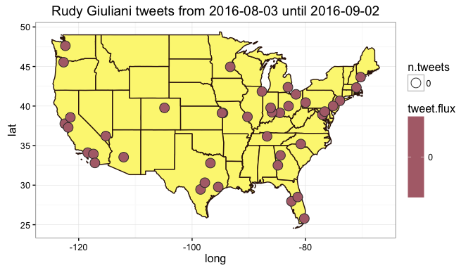

# Metro Areas with Rudy Giuliani tweet flux
Winston Saunders  
Oct 1, 2016  

# Rev
    0.1 28 Sept 2016 supporess printing of all the code
    0.2 30 Sept 2016 use metro area populations from wikipedia
    0.5 1 Oct 2016 add ChoroplethRmaps to reduce 'chart junk' and add date span
    

# Set-up


```
[1] "Using direct authentication"
```

Get city geo data from `maps::cities`


Select number of cities


```r
    n.cities <- 40
```

The top Cities are:


<!-- html table generated in R 3.3.0 by xtable 1.8-2 package -->
<!--  -->
<table border=1>
<tr> <th> rank </th> <th> population </th> <th> metro </th> <th> metro_match </th> <th> name </th> <th> country.etc </th> <th> pop </th> <th> lat </th> <th> long </th> <th> city_name </th>  </tr>
  <tr> <td align="right">   1 </td> <td align="right"> 20182305 </td> <td> New York </td> <td> new york </td> <td> New York NY </td> <td> NY </td> <td align="right"> 8124427 </td> <td align="right"> 40.67 </td> <td align="right"> -73.94 </td> <td> New York </td> </tr>
  <tr> <td align="right">   2 </td> <td align="right"> 13340068 </td> <td> Los Angeles </td> <td> los angeles </td> <td> Los Angeles CA </td> <td> CA </td> <td align="right"> 3911500 </td> <td align="right"> 34.11 </td> <td align="right"> -118.41 </td> <td> Los Angeles </td> </tr>
  <tr> <td align="right">   3 </td> <td align="right"> 9551031 </td> <td> Chicago </td> <td> chicago </td> <td> Chicago IL </td> <td> IL </td> <td align="right"> 2830144 </td> <td align="right"> 41.84 </td> <td align="right"> -87.68 </td> <td> Chicago </td> </tr>
  <tr> <td align="right">   4 </td> <td align="right"> 7102796 </td> <td> Dallas </td> <td> dallas </td> <td> Dallas TX </td> <td> TX </td> <td align="right"> 1216543 </td> <td align="right"> 32.79 </td> <td align="right"> -96.77 </td> <td> Dallas </td> </tr>
  <tr> <td align="right">   5 </td> <td align="right"> 6656947 </td> <td> Houston </td> <td> houston </td> <td> Houston TX </td> <td> TX </td> <td align="right"> 2043005 </td> <td align="right"> 29.77 </td> <td align="right"> -95.39 </td> <td> Houston </td> </tr>
  <tr> <td align="right">   6 </td> <td align="right"> 6097684 </td> <td> Washington </td> <td> washington </td> <td> WASHINGTON DC </td> <td> DC </td> <td align="right"> 548359 </td> <td align="right"> 38.91 </td> <td align="right"> -77.02 </td> <td> WASHINGTON </td> </tr>
  <tr> <td align="right">   7 </td> <td align="right"> 6069875 </td> <td> Philadelphia </td> <td> philadelphia </td> <td> Philadelphia PA </td> <td> PA </td> <td align="right"> 1439814 </td> <td align="right"> 40.01 </td> <td align="right"> -75.13 </td> <td> Philadelphia </td> </tr>
  <tr> <td align="right">   8 </td> <td align="right"> 6012331 </td> <td> Miami </td> <td> miami </td> <td> Miami FL </td> <td> FL </td> <td align="right"> 386740 </td> <td align="right"> 25.78 </td> <td align="right"> -80.21 </td> <td> Miami </td> </tr>
  <tr> <td align="right">   9 </td> <td align="right"> 5710795 </td> <td> Atlanta </td> <td> atlanta </td> <td> Atlanta GA </td> <td> GA </td> <td align="right"> 424096 </td> <td align="right"> 33.76 </td> <td align="right"> -84.42 </td> <td> Atlanta </td> </tr>
  <tr> <td align="right">  10 </td> <td align="right"> 4774321 </td> <td> Boston </td> <td> boston </td> <td> Boston MA </td> <td> MA </td> <td align="right"> 567759 </td> <td align="right"> 42.34 </td> <td align="right"> -71.02 </td> <td> Boston </td> </tr>
   </table>

Data collection for the top 40 cities (by population) in the U.S. This includes cities from New York NY to Nashville TN.

Keeping first 40 metro areas comprises a total population of 174.3 million people. 


## search


```r
## set up search terms
searchString.x <- "Rudy Giuliani"    # search term
n.x <- 3000                     # number of tweets
radius <- "30mi"               # radius around selected geo-location
days.ago <-60
duration.days <- 30             # how many days
since.date <- (Sys.Date() - days.ago) %>% as.character # calculated starting date
until.date <- (Sys.Date() - days.ago + duration.days) %>% as.character # calculated ending date
```

# Rudy Giuliani geo-preference.


Use the `twitteR::searchTwitter` command. 


# Tweet-Map for Rudy Giuliani?


```r
    #map.plot +  ## use this to underlay with google map
    ggplot() +   ## use this to underlay with simple border outlines
    geom_polygon(data = state.map %>% filter(region != "alaska" & region != "hawaii"), aes(x=long, y=lat, group = group), fill = "#FCF581", color = "#36180D", size =0.5) +
    geom_point(aes(x = lon, y = lat, fill = tweet.flux, size = n.tweets), data=analyzed_df, pch=21, color = "#333333") +
    ggtitle(paste0(searchString.x, " tweets from ", since.date, " until ", until.date)) +
    scale_fill_gradient(low = "#92A0CD", high = "#B32F2A", space = "Lab", na.value = "grey50", guide = "colourbar") +
        theme_bw()
```




## Rudy Giuliani AMB tweet-flux

Here are the top few cities by tweet flux (in "twipermipeds").

<!-- html table generated in R 3.3.0 by xtable 1.8-2 package -->
<!--  -->
<table border=1>
<tr> <th> name </th> <th> tweet.flux </th> <th> n.tweets </th> <th> population </th>  </tr>
  <tr> <td> New York </td> <td align="right"> 0.00 </td> <td align="right">   0 </td> <td align="right"> 20182305 </td> </tr>
  <tr> <td> Los Angeles </td> <td align="right"> 0.00 </td> <td align="right">   0 </td> <td align="right"> 13340068 </td> </tr>
  <tr> <td> Chicago </td> <td align="right"> 0.00 </td> <td align="right">   0 </td> <td align="right"> 9551031 </td> </tr>
  <tr> <td> Dallas </td> <td align="right"> 0.00 </td> <td align="right">   0 </td> <td align="right"> 7102796 </td> </tr>
  <tr> <td> Houston </td> <td align="right"> 0.00 </td> <td align="right">   0 </td> <td align="right"> 6656947 </td> </tr>
  <tr> <td> Washington </td> <td align="right"> 0.00 </td> <td align="right">   0 </td> <td align="right"> 6097684 </td> </tr>
  <tr> <td> Philadelphia </td> <td align="right"> 0.00 </td> <td align="right">   0 </td> <td align="right"> 6069875 </td> </tr>
  <tr> <td> Miami </td> <td align="right"> 0.00 </td> <td align="right">   0 </td> <td align="right"> 6012331 </td> </tr>
  <tr> <td> Atlanta </td> <td align="right"> 0.00 </td> <td align="right">   0 </td> <td align="right"> 5710795 </td> </tr>
  <tr> <td> Boston </td> <td align="right"> 0.00 </td> <td align="right">   0 </td> <td align="right"> 4774321 </td> </tr>
  <tr> <td> San Francisco </td> <td align="right"> 0.00 </td> <td align="right">   0 </td> <td align="right"> 4656132 </td> </tr>
  <tr> <td> Phoenix </td> <td align="right"> 0.00 </td> <td align="right">   0 </td> <td align="right"> 4574531 </td> </tr>
  <tr> <td> Riverside </td> <td align="right"> 0.00 </td> <td align="right">   0 </td> <td align="right"> 4489159 </td> </tr>
  <tr> <td> Detroit </td> <td align="right"> 0.00 </td> <td align="right">   0 </td> <td align="right"> 4302043 </td> </tr>
  <tr> <td> Seattle </td> <td align="right"> 0.00 </td> <td align="right">   0 </td> <td align="right"> 3733580 </td> </tr>
   </table>

## Rudy Giuliani AMB tweet count

Here are the top few cities sorted by raw tweets, again with major metro areas leading. Note that some other cities, like Chicago, have a large number of tweets but a lower flux because of their higher population.

<!-- html table generated in R 3.3.0 by xtable 1.8-2 package -->
<!--  -->
<table border=1>
<tr> <th> name </th> <th> tweet.flux </th> <th> n.tweets </th> <th> population </th>  </tr>
  <tr> <td> New York </td> <td align="right"> 0.00 </td> <td align="right">   0 </td> <td align="right"> 20182305 </td> </tr>
  <tr> <td> Los Angeles </td> <td align="right"> 0.00 </td> <td align="right">   0 </td> <td align="right"> 13340068 </td> </tr>
  <tr> <td> Chicago </td> <td align="right"> 0.00 </td> <td align="right">   0 </td> <td align="right"> 9551031 </td> </tr>
  <tr> <td> Dallas </td> <td align="right"> 0.00 </td> <td align="right">   0 </td> <td align="right"> 7102796 </td> </tr>
  <tr> <td> Houston </td> <td align="right"> 0.00 </td> <td align="right">   0 </td> <td align="right"> 6656947 </td> </tr>
  <tr> <td> Washington </td> <td align="right"> 0.00 </td> <td align="right">   0 </td> <td align="right"> 6097684 </td> </tr>
  <tr> <td> Philadelphia </td> <td align="right"> 0.00 </td> <td align="right">   0 </td> <td align="right"> 6069875 </td> </tr>
  <tr> <td> Miami </td> <td align="right"> 0.00 </td> <td align="right">   0 </td> <td align="right"> 6012331 </td> </tr>
  <tr> <td> Atlanta </td> <td align="right"> 0.00 </td> <td align="right">   0 </td> <td align="right"> 5710795 </td> </tr>
  <tr> <td> Boston </td> <td align="right"> 0.00 </td> <td align="right">   0 </td> <td align="right"> 4774321 </td> </tr>
  <tr> <td> San Francisco </td> <td align="right"> 0.00 </td> <td align="right">   0 </td> <td align="right"> 4656132 </td> </tr>
  <tr> <td> Phoenix </td> <td align="right"> 0.00 </td> <td align="right">   0 </td> <td align="right"> 4574531 </td> </tr>
  <tr> <td> Riverside </td> <td align="right"> 0.00 </td> <td align="right">   0 </td> <td align="right"> 4489159 </td> </tr>
  <tr> <td> Detroit </td> <td align="right"> 0.00 </td> <td align="right">   0 </td> <td align="right"> 4302043 </td> </tr>
  <tr> <td> Seattle </td> <td align="right"> 0.00 </td> <td align="right">   0 </td> <td align="right"> 3733580 </td> </tr>
   </table>


