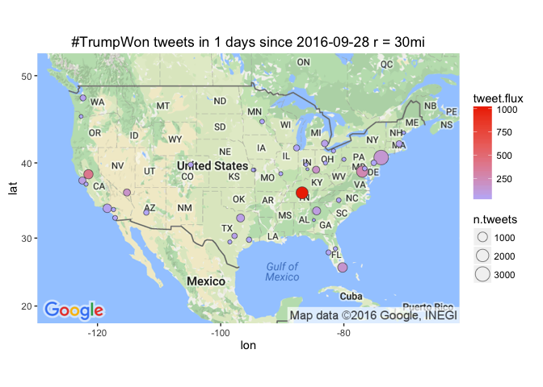

# Leading Metro Areas with #TrumpWon tweet flux
Winston Saunders  
September 23, 2016  

# setup


```r
## set up search terms
searchString.x <- "#TrumpWon"    # search term
n.x <- 3000                     # number of tweets
radius <- "30mi"               # radius around selected geo-location
duration.days <- 1             # how many days
since.date <- (Sys.Date() - duration.days) %>% as.character # calculated starting date
```

# #TrumpWon geo-preference.


```
[1] "Using direct authentication"
```


Get city geo data from `maps::cities`


Use the `twitteR::searchTwitter` command. 


```r
n.cities <- 40
```

Data collection for the top 40 cities (by population) in the U.S. This includes cities from New York to Nashville.


# Tweet-Map for #TrumpWon?


```r
map.plot +
    geom_point(aes(x = lon, y = lat, fill = tweet.flux, size = n.tweets), data=analyzed_df, pch=21, color = "#33333399") +
    ggtitle(paste0(searchString.x, " tweets in ", duration.days," days since ", since.date, " r = ", radius)) +
    scale_fill_gradient(low = "#BBBBFF", high = "#EE3300", space = "Lab", na.value = "grey50", guide = "colourbar")
```




## #TrumpWon AMB tweet-flux

Here are the top few cities by tweet flux (in "twipermipeds").

<!-- html table generated in R 3.3.0 by xtable 1.8-2 package -->
<!--  -->
<table border=1>
<tr> <th> name </th> <th> tweet.flux </th> <th> n.tweets </th> <th> population </th>  </tr>
  <tr> <td> Nashville </td> <td align="right"> 1002.54 </td> <td align="right"> 1835 </td> <td align="right"> 1830345 </td> </tr>
  <tr> <td> Sacramento </td> <td align="right"> 394.87 </td> <td align="right"> 898 </td> <td align="right"> 2274194 </td> </tr>
  <tr> <td> Washington </td> <td align="right"> 257.47 </td> <td align="right"> 1570 </td> <td align="right"> 6097684 </td> </tr>
  <tr> <td> Cincinnati </td> <td align="right"> 178.89 </td> <td align="right"> 386 </td> <td align="right"> 2157719 </td> </tr>
  <tr> <td> Las Vegas </td> <td align="right"> 175.90 </td> <td align="right"> 372 </td> <td align="right"> 2114801 </td> </tr>
  <tr> <td> Miami </td> <td align="right"> 160.84 </td> <td align="right"> 967 </td> <td align="right"> 6012331 </td> </tr>
  <tr> <td> New York </td> <td align="right"> 148.65 </td> <td align="right"> 3000 </td> <td align="right"> 20182305 </td> </tr>
  <tr> <td> Atlanta </td> <td align="right"> 100.16 </td> <td align="right"> 572 </td> <td align="right"> 5710795 </td> </tr>
  <tr> <td> San Francisco </td> <td align="right"> 86.55 </td> <td align="right"> 403 </td> <td align="right"> 4656132 </td> </tr>
  <tr> <td> Dallas </td> <td align="right"> 78.14 </td> <td align="right"> 555 </td> <td align="right"> 7102796 </td> </tr>
  <tr> <td> Detroit </td> <td align="right"> 70.43 </td> <td align="right"> 303 </td> <td align="right"> 4302043 </td> </tr>
  <tr> <td> Austin </td> <td align="right"> 66.97 </td> <td align="right"> 134 </td> <td align="right"> 2000860 </td> </tr>
  <tr> <td> Los Angeles </td> <td align="right"> 52.70 </td> <td align="right"> 703 </td> <td align="right"> 13340068 </td> </tr>
  <tr> <td> Seattle </td> <td align="right"> 50.35 </td> <td align="right"> 188 </td> <td align="right"> 3733580 </td> </tr>
  <tr> <td> Boston </td> <td align="right"> 49.22 </td> <td align="right"> 235 </td> <td align="right"> 4774321 </td> </tr>
   </table>

## #TrumpWon AMB tweet count

Here are the top few cities sorted by raw tweets, again with major metro areas leading. Note that some other cities, like Chicago, have a large number of tweets but a lower flux because of their higher population.

<!-- html table generated in R 3.3.0 by xtable 1.8-2 package -->
<!--  -->
<table border=1>
<tr> <th> name </th> <th> tweet.flux </th> <th> n.tweets </th> <th> population </th>  </tr>
  <tr> <td> New York </td> <td align="right"> 148.65 </td> <td align="right"> 3000 </td> <td align="right"> 20182305 </td> </tr>
  <tr> <td> Nashville </td> <td align="right"> 1002.54 </td> <td align="right"> 1835 </td> <td align="right"> 1830345 </td> </tr>
  <tr> <td> Washington </td> <td align="right"> 257.47 </td> <td align="right"> 1570 </td> <td align="right"> 6097684 </td> </tr>
  <tr> <td> Miami </td> <td align="right"> 160.84 </td> <td align="right"> 967 </td> <td align="right"> 6012331 </td> </tr>
  <tr> <td> Sacramento </td> <td align="right"> 394.87 </td> <td align="right"> 898 </td> <td align="right"> 2274194 </td> </tr>
  <tr> <td> Los Angeles </td> <td align="right"> 52.70 </td> <td align="right"> 703 </td> <td align="right"> 13340068 </td> </tr>
  <tr> <td> Atlanta </td> <td align="right"> 100.16 </td> <td align="right"> 572 </td> <td align="right"> 5710795 </td> </tr>
  <tr> <td> Dallas </td> <td align="right"> 78.14 </td> <td align="right"> 555 </td> <td align="right"> 7102796 </td> </tr>
  <tr> <td> San Francisco </td> <td align="right"> 86.55 </td> <td align="right"> 403 </td> <td align="right"> 4656132 </td> </tr>
  <tr> <td> Cincinnati </td> <td align="right"> 178.89 </td> <td align="right"> 386 </td> <td align="right"> 2157719 </td> </tr>
  <tr> <td> Las Vegas </td> <td align="right"> 175.90 </td> <td align="right"> 372 </td> <td align="right"> 2114801 </td> </tr>
  <tr> <td> Detroit </td> <td align="right"> 70.43 </td> <td align="right"> 303 </td> <td align="right"> 4302043 </td> </tr>
  <tr> <td> Boston </td> <td align="right"> 49.22 </td> <td align="right"> 235 </td> <td align="right"> 4774321 </td> </tr>
  <tr> <td> Chicago </td> <td align="right"> 22.82 </td> <td align="right"> 218 </td> <td align="right"> 9551031 </td> </tr>
  <tr> <td> Seattle </td> <td align="right"> 50.35 </td> <td align="right"> 188 </td> <td align="right"> 3733580 </td> </tr>
   </table>

  
  


