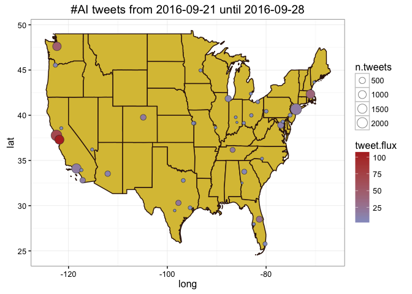

# Metro Areas with #TrumpWon v. #HillaryWon tweet flux
Winston Saunders  
September 29, 2016  

# Rev
    0.1 1 Oct 2016 add ChoroplethRmaps to make data appear cleaner

# Set-up


```
[1] "Using direct authentication"
```

Get city geo data from `maps::cities`


Select number of cities


```r
    n.cities <- 20
```


Data collection for the top 20 cities (by population) in the U.S. This includes cities from New York NY to Saint Louis MO.

Keeping first 20 metro areas comprises a total population of 122.7 million people. 


## search


```r
## set up search terms
searchString.x <- "#ImWithHer"    # search term
n.x <- 3000                     # number of tweets
radius <- "30mi"               # radius around selected geo-location
days.ago <-4
duration.days <- 3             # how many days
since.date <- (Sys.Date() - days.ago) %>% as.character # calculated starting date
until.date <- (Sys.Date() - days.ago + duration.days) %>% as.character # calculated ending date
```

# #ImWithHer geo-preference.


Use the `twitteR::searchTwitter` command. 


```
[1] "Rate limited .... blocking for a minute and retrying up to 119 times ..."
[1] "Rate limited .... blocking for a minute and retrying up to 118 times ..."
[1] "Rate limited .... blocking for a minute and retrying up to 117 times ..."
[1] "Rate limited .... blocking for a minute and retrying up to 116 times ..."
[1] "Rate limited .... blocking for a minute and retrying up to 115 times ..."
[1] "Rate limited .... blocking for a minute and retrying up to 114 times ..."
[1] "Rate limited .... blocking for a minute and retrying up to 113 times ..."
[1] "Rate limited .... blocking for a minute and retrying up to 112 times ..."
[1] "Rate limited .... blocking for a minute and retrying up to 111 times ..."
```


# Tweet-Map for #ImWithHer?


```r
    map.plot +  ## use this to underlay with google map
    #ggplot() +   ## use this to underlay with simple border outlines
    geom_polygon(data = state.map %>% filter(region != "alaska" & region != "hawaii"), aes(x=long, y=lat, group = group), fill = NA, color = "#36180D") +
    geom_point(aes(x = lon, y = lat, fill = tweet.flux, size = n.tweets), data=analyzed_df, pch=21, color = "#33333399") +
    ggtitle(paste0(searchString.x, " tweets from ", since.date, " until ", until.date)) +
    scale_fill_gradient(low = "#92A0CD", high = "#B32F2A", space = "Lab", na.value = "grey50", guide = "colourbar") +
        theme_bw()
```




## #ImWithHer AMB tweet-flux

Here are the top few cities by tweet flux (in "twipermipeds").

<!-- html table generated in R 3.3.0 by xtable 1.8-2 package -->
<!--  -->
<table border=1>
<tr> <th> name </th> <th> lon </th> <th> lat </th> <th> tweet.flux </th> <th> n.tweets </th> <th> population </th>  </tr>
  <tr> <td> San Francisco CA </td> <td align="right"> -122.45 </td> <td align="right"> 37.77 </td> <td align="right"> 214.77 </td> <td align="right"> 3000 </td> <td align="right"> 4656132 </td> </tr>
  <tr> <td> Boston MA </td> <td align="right"> -71.02 </td> <td align="right"> 42.34 </td> <td align="right"> 209.45 </td> <td align="right"> 3000 </td> <td align="right"> 4774321 </td> </tr>
  <tr> <td> San Diego CA </td> <td align="right"> -117.14 </td> <td align="right"> 32.81 </td> <td align="right"> 189.02 </td> <td align="right"> 1871 </td> <td align="right"> 3299521 </td> </tr>
  <tr> <td> Seattle WA </td> <td align="right"> -122.35 </td> <td align="right"> 47.62 </td> <td align="right"> 181.86 </td> <td align="right"> 2037 </td> <td align="right"> 3733580 </td> </tr>
  <tr> <td> Philadelphia PA </td> <td align="right"> -75.13 </td> <td align="right"> 40.01 </td> <td align="right"> 164.75 </td> <td align="right"> 3000 </td> <td align="right"> 6069875 </td> </tr>
  <tr> <td> WASHINGTON DC </td> <td align="right"> -77.02 </td> <td align="right"> 38.91 </td> <td align="right"> 164.00 </td> <td align="right"> 3000 </td> <td align="right"> 6097684 </td> </tr>
  <tr> <td> Denver CO </td> <td align="right"> -104.87 </td> <td align="right"> 39.77 </td> <td align="right"> 155.63 </td> <td align="right"> 1314 </td> <td align="right"> 2814330 </td> </tr>
  <tr> <td> Minneapolis MN </td> <td align="right"> -93.27 </td> <td align="right"> 44.96 </td> <td align="right"> 142.71 </td> <td align="right"> 1509 </td> <td align="right"> 3524583 </td> </tr>
  <tr> <td> Atlanta GA </td> <td align="right"> -84.42 </td> <td align="right"> 33.76 </td> <td align="right"> 123.74 </td> <td align="right"> 2120 </td> <td align="right"> 5710795 </td> </tr>
  <tr> <td> Chicago IL </td> <td align="right"> -87.68 </td> <td align="right"> 41.84 </td> <td align="right"> 104.70 </td> <td align="right"> 3000 </td> <td align="right"> 9551031 </td> </tr>
  <tr> <td> Tampa FL </td> <td align="right"> -82.48 </td> <td align="right"> 27.96 </td> <td align="right"> 95.57 </td> <td align="right"> 853 </td> <td align="right"> 2975225 </td> </tr>
  <tr> <td> Houston TX </td> <td align="right"> -95.39 </td> <td align="right"> 29.77 </td> <td align="right"> 91.33 </td> <td align="right"> 1824 </td> <td align="right"> 6656947 </td> </tr>
  <tr> <td> Miami FL </td> <td align="right"> -80.21 </td> <td align="right"> 25.78 </td> <td align="right"> 88.87 </td> <td align="right"> 1603 </td> <td align="right"> 6012331 </td> </tr>
  <tr> <td> Riverside CA </td> <td align="right"> -117.40 </td> <td align="right"> 33.94 </td> <td align="right"> 81.90 </td> <td align="right"> 1103 </td> <td align="right"> 4489159 </td> </tr>
  <tr> <td> Los Angeles CA </td> <td align="right"> -118.41 </td> <td align="right"> 34.11 </td> <td align="right"> 74.96 </td> <td align="right"> 3000 </td> <td align="right"> 13340068 </td> </tr>
   </table>

## #ImWithHer AMB tweet count

Here are the top few cities sorted by raw tweets, again with major metro areas leading. Note that some other cities, like Chicago, have a large number of tweets but a lower flux because of their higher population.

<!-- html table generated in R 3.3.0 by xtable 1.8-2 package -->
<!--  -->
<table border=1>
<tr> <th> name </th> <th> lon </th> <th> lat </th> <th> tweet.flux </th> <th> n.tweets </th> <th> population </th>  </tr>
  <tr> <td> New York NY </td> <td align="right"> -73.94 </td> <td align="right"> 40.67 </td> <td align="right"> 49.55 </td> <td align="right"> 3000 </td> <td align="right"> 20182305 </td> </tr>
  <tr> <td> Los Angeles CA </td> <td align="right"> -118.41 </td> <td align="right"> 34.11 </td> <td align="right"> 74.96 </td> <td align="right"> 3000 </td> <td align="right"> 13340068 </td> </tr>
  <tr> <td> Chicago IL </td> <td align="right"> -87.68 </td> <td align="right"> 41.84 </td> <td align="right"> 104.70 </td> <td align="right"> 3000 </td> <td align="right"> 9551031 </td> </tr>
  <tr> <td> WASHINGTON DC </td> <td align="right"> -77.02 </td> <td align="right"> 38.91 </td> <td align="right"> 164.00 </td> <td align="right"> 3000 </td> <td align="right"> 6097684 </td> </tr>
  <tr> <td> Philadelphia PA </td> <td align="right"> -75.13 </td> <td align="right"> 40.01 </td> <td align="right"> 164.75 </td> <td align="right"> 3000 </td> <td align="right"> 6069875 </td> </tr>
  <tr> <td> Boston MA </td> <td align="right"> -71.02 </td> <td align="right"> 42.34 </td> <td align="right"> 209.45 </td> <td align="right"> 3000 </td> <td align="right"> 4774321 </td> </tr>
  <tr> <td> San Francisco CA </td> <td align="right"> -122.45 </td> <td align="right"> 37.77 </td> <td align="right"> 214.77 </td> <td align="right"> 3000 </td> <td align="right"> 4656132 </td> </tr>
  <tr> <td> Atlanta GA </td> <td align="right"> -84.42 </td> <td align="right"> 33.76 </td> <td align="right"> 123.74 </td> <td align="right"> 2120 </td> <td align="right"> 5710795 </td> </tr>
  <tr> <td> Seattle WA </td> <td align="right"> -122.35 </td> <td align="right"> 47.62 </td> <td align="right"> 181.86 </td> <td align="right"> 2037 </td> <td align="right"> 3733580 </td> </tr>
  <tr> <td> San Diego CA </td> <td align="right"> -117.14 </td> <td align="right"> 32.81 </td> <td align="right"> 189.02 </td> <td align="right"> 1871 </td> <td align="right"> 3299521 </td> </tr>
  <tr> <td> Houston TX </td> <td align="right"> -95.39 </td> <td align="right"> 29.77 </td> <td align="right"> 91.33 </td> <td align="right"> 1824 </td> <td align="right"> 6656947 </td> </tr>
  <tr> <td> Miami FL </td> <td align="right"> -80.21 </td> <td align="right"> 25.78 </td> <td align="right"> 88.87 </td> <td align="right"> 1603 </td> <td align="right"> 6012331 </td> </tr>
  <tr> <td> Minneapolis MN </td> <td align="right"> -93.27 </td> <td align="right"> 44.96 </td> <td align="right"> 142.71 </td> <td align="right"> 1509 </td> <td align="right"> 3524583 </td> </tr>
  <tr> <td> Dallas TX </td> <td align="right"> -96.77 </td> <td align="right"> 32.79 </td> <td align="right"> 67.81 </td> <td align="right"> 1445 </td> <td align="right"> 7102796 </td> </tr>
  <tr> <td> Denver CO </td> <td align="right"> -104.87 </td> <td align="right"> 39.77 </td> <td align="right"> 155.63 </td> <td align="right"> 1314 </td> <td align="right"> 2814330 </td> </tr>
   </table>


