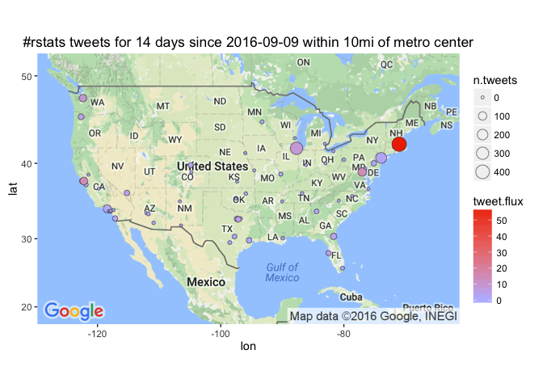

# Leading Cities in #rstats Twipermipeds
Winston Saunders  
September 22, 2016  

# Summary

The question "what's the best city for data science?" was asked on the Sept ["Not So Standard Deviations"](https://www.patreon.com/NSSDeviations) podcast. To inject some analysis in the discussion, I used the `twitteR` package to measure interest in __R__ by computing the "flux" of tweets with the `#rstats` hashtag.   
The top metro areas are New York, Boston, and the SF Bay area, with a tweet flux of about 50 #rstat tweets per million residents per day ("twepermipeds"). Other leading cities include Long Beach, Washington DC, Seattle, Raleigh NC, and Henderson NV.  
Even Portland, Oregon (*yay*) weighs-in within the top 15 on tweets.
Results are sensitive to assumptions about metro size and show some short term time dependency.   
This was quick and dirty so no telling how stable the result will be over longer time.  

# Problem Statement

In their September Podcast, Hilary and Roger discussed "_the best city for data science._" I've never met a person from SF who didn't think SF was the best at everything, so I decided to try measuring something just to double check.  


# Where do I get data?

## Tweets, the Twitter API, and twitteR package.

Setting up the twitter API is relatively quick. 


```r
library(twitteR)
## create URLs
reqURL <- "https://api.twitter.com/oauth/request_token"
accessURL <- "https://api.twitter.com/oauth/access_token"
authURL <- "https://api.twitter.com/oauth/authorize"

## read file containing secret keys (obtained from apps.twitter.com)
keys <- read.table("/users/winstonsaunders/documents/city_politics/secret_t.key.txt")
## convert to characters
consumerKey <- keys[1,]%>%as.character()
consumerSecret <- keys[2,]%>%as.character()
accessToken <- keys[3,]%>%as.character()
accessTokenSecret <- keys[4,]%>%as.character()

## set up authentication
setup_twitter_oauth(consumerKey, consumerSecret, accessToken, accessTokenSecret)
```

```
[1] "Using direct authentication"
```


```r
## test functionanlity with Michelle Obama tweets
userTimeline(getUser('michelleobama'), n=1, includeRts=FALSE, excludeReplies=FALSE)
```

```
[[1]]
[1] "MichelleObama: “We can give all our children the bright, healthy futures they so richly deserve.” http://t.co/EgStdzksym #LetsMove"
```


## City populations and geo-locations

City coordinates and populations are available in the super-convenient  [`{maps}`](https://cran.r-project.org/web/packages/maps/index.html) package, which contains all the information we need for plotting and normalizing tweet data. 


```r
    require(maps)
    cities <- us.cities
    
    ## create city_name by removing state designnator
    cities <- cities %>% mutate(city_name = gsub(' [A-Z]{2,}','', name))
    ## clean
    cities <- cities[complete.cases(cities),] %>% as_data_frame
    ## sort
    cities <- cities[order(cities$pop, decreasing = TRUE), ]
```
 
The top cities by population are:  

<!-- html table generated in R 3.3.0 by xtable 1.8-2 package -->
<!--  -->
<table border=1>
<tr> <th> name </th> <th> country.etc </th> <th> pop </th> <th> lat </th> <th> long </th> <th> capital </th> <th> city_name </th>  </tr>
  <tr> <td align="right"> New York NY </td> <td align="center"> NY </td> <td align="center"> 8124427 </td> <td align="center"> 40.67 </td> <td align="center"> -73.94 </td> <td align="center">   0 </td> <td align="center"> New York </td> </tr>
  <tr> <td align="right"> Los Angeles CA </td> <td align="center"> CA </td> <td align="center"> 3911500 </td> <td align="center"> 34.11 </td> <td align="center"> -118.41 </td> <td align="center">   0 </td> <td align="center"> Los Angeles </td> </tr>
  <tr> <td align="right"> Chicago IL </td> <td align="center"> IL </td> <td align="center"> 2830144 </td> <td align="center"> 41.84 </td> <td align="center"> -87.68 </td> <td align="center">   0 </td> <td align="center"> Chicago </td> </tr>
  <tr> <td align="right"> Houston TX </td> <td align="center"> TX </td> <td align="center"> 2043005 </td> <td align="center"> 29.77 </td> <td align="center"> -95.39 </td> <td align="center">   0 </td> <td align="center"> Houston </td> </tr>
  <tr> <td align="right"> Phoenix AZ </td> <td align="center"> AZ </td> <td align="center"> 1450884 </td> <td align="center"> 33.54 </td> <td align="center"> -112.07 </td> <td align="center">   2 </td> <td align="center"> Phoenix </td> </tr>
  <tr> <td align="right"> Philadelphia PA </td> <td align="center"> PA </td> <td align="center"> 1439814 </td> <td align="center"> 40.01 </td> <td align="center"> -75.13 </td> <td align="center">   0 </td> <td align="center"> Philadelphia </td> </tr>
  <tr> <td align="right"> San Diego CA </td> <td align="center"> CA </td> <td align="center"> 1299352 </td> <td align="center"> 32.81 </td> <td align="center"> -117.14 </td> <td align="center">   0 </td> <td align="center"> San Diego </td> </tr>
  <tr> <td align="right"> San Antonio TX </td> <td align="center"> TX </td> <td align="center"> 1278171 </td> <td align="center"> 29.46 </td> <td align="center"> -98.51 </td> <td align="center">   0 </td> <td align="center"> San Antonio </td> </tr>
  <tr> <td align="right"> Dallas TX </td> <td align="center"> TX </td> <td align="center"> 1216543 </td> <td align="center"> 32.79 </td> <td align="center"> -96.77 </td> <td align="center">   0 </td> <td align="center"> Dallas </td> </tr>
  <tr> <td align="right"> San Jose CA </td> <td align="center"> CA </td> <td align="center"> 897883 </td> <td align="center"> 37.30 </td> <td align="center"> -121.85 </td> <td align="center">   0 </td> <td align="center"> San Jose </td> </tr>
   </table>


## Getting the actual data

To get the tweet data use the `twitteR::searchTwiter` command. 
Data collection is with the following variables. 


```r
## set up search terms
searchString.x <- "#rstats"    # search term
n.x <- 900                     # number of tweets
radius <- "10mi"               # radius around selected geo-location
duration.days <- 14             # how many days
since.date <- (Sys.Date() - duration.days) %>% as.character # calculated starting date
```

Note the radius of 10mi, which is used to localize tweet collected around specific geo-locations.  For cases, where major cities are in close proximity, this certainly picks up some redundant tweets. Life in the big leagues. This is someting to work on.


```r
n.cities <- 57
```

```
[1] "Rate limited .... blocking for a minute and retrying up to 119 times ..."
```

I pull data for the top 57 cities (by population) in the U.S. This includes cities from New York NY to Riverside CA.

# Analysis

Once collected, the data are lightly analyzed. Specifically the 'tweet.flux', representing the number of tweets per million people per day ("twepermipeds"), is computed.


```r
analyzed_df <- collected_df %>% 
    mutate("tweet.flux" = 10^6 * n.tweets/population/duration.days ) %>% 
    select(name, lon, lat, tweet.flux, n.tweets, population)
```


Collected data are put into  `collected_df`. For this first-pass analysis tweets are counted but are not cached. 

# So, what _does_ the Tweet-Map look like?

Use the `{ggmap}` package to get a base Google map.


```r
    library(ggmap)
    map = get_googlemap(center =  c(lon = -95.58, lat = 36.83), 
              zoom = 3, size = c(390, 250), scale = 2, source = "google",
              maptype="roadmap") #, key = my.secret.key)
    map.plot <- ggmap(map)
```

After that standard `ggplot2` functions are used to plot the data. Note that several dimensions of data are shown. The latitude and longitude reprsent the geolocation of the town. The size of the point represents the number of tweets `n.tweets` and the shading of the dot represents the `tweet.flux` in "twepermipeds.""


```r
map.plot +
    geom_point(aes(x = lon, y = lat, fill = tweet.flux, size = n.tweets), data=analyzed_df, pch=21, color = "#33333399") +
    ggtitle(paste0(searchString.x, " tweets for ", duration.days," days since ", since.date, " within ", radius, " of metro center")) +
    scale_fill_gradient(low = "#BBBBFF", high = "#EE3300", space = "Lab", na.value = "grey50", guide = "colourbar")
```



# What are the top cities in #rstats?

## AMB twepermipeds

Here are the top few cities by tweet flux (in "twepermipeds").

<!-- html table generated in R 3.3.0 by xtable 1.8-2 package -->
<!--  -->
<table border=1>
<tr> <th> name </th> <th> tweet.flux </th> <th> n.tweets </th> <th> population </th>  </tr>
  <tr> <td> Boston MA </td> <td align="right"> 59.63 </td> <td align="right"> 474 </td> <td align="right"> 567759 </td> </tr>
  <tr> <td> Oakland CA </td> <td align="right"> 13.97 </td> <td align="right">  77 </td> <td align="right"> 393632 </td> </tr>
  <tr> <td> WASHINGTON DC </td> <td align="right"> 13.29 </td> <td align="right"> 102 </td> <td align="right"> 548359 </td> </tr>
  <tr> <td> Seattle WA </td> <td align="right"> 8.89 </td> <td align="right">  71 </td> <td align="right"> 570430 </td> </tr>
  <tr> <td> Chicago IL </td> <td align="right"> 8.08 </td> <td align="right"> 320 </td> <td align="right"> 2830144 </td> </tr>
  <tr> <td> Arlington TX </td> <td align="right"> 4.57 </td> <td align="right">  24 </td> <td align="right"> 374729 </td> </tr>
  <tr> <td> Portland OR </td> <td align="right"> 3.68 </td> <td align="right">  28 </td> <td align="right"> 542751 </td> </tr>
  <tr> <td> Jacksonville FL </td> <td align="right"> 3.62 </td> <td align="right">  41 </td> <td align="right"> 809874 </td> </tr>
  <tr> <td> Tampa FL </td> <td align="right"> 3.48 </td> <td align="right">  16 </td> <td align="right"> 328578 </td> </tr>
  <tr> <td> Las Vegas NV </td> <td align="right"> 2.97 </td> <td align="right">  23 </td> <td align="right"> 553807 </td> </tr>
  <tr> <td> Fort Worth TX </td> <td align="right"> 2.70 </td> <td align="right">  24 </td> <td align="right"> 633849 </td> </tr>
  <tr> <td> San Francisco CA </td> <td align="right"> 2.27 </td> <td align="right">  23 </td> <td align="right"> 723724 </td> </tr>
  <tr> <td> Atlanta GA </td> <td align="right"> 2.19 </td> <td align="right">  13 </td> <td align="right"> 424096 </td> </tr>
  <tr> <td> New York NY </td> <td align="right"> 1.93 </td> <td align="right"> 219 </td> <td align="right"> 8124427 </td> </tr>
  <tr> <td> Denver CO </td> <td align="right"> 1.93 </td> <td align="right">  15 </td> <td align="right"> 556575 </td> </tr>
   </table>

## AMB tweets

Here are the top few cities sorted by raw tweets, again with major metro areas leading. Note that some other cities, like Chicago, have a large number of tweets but a lower flux because of their higher population.

<!-- html table generated in R 3.3.0 by xtable 1.8-2 package -->
<!--  -->
<table border=1>
<tr> <th> name </th> <th> tweet.flux </th> <th> n.tweets </th> <th> population </th>  </tr>
  <tr> <td> Boston MA </td> <td align="right"> 59.63 </td> <td align="right"> 474 </td> <td align="right"> 567759 </td> </tr>
  <tr> <td> Chicago IL </td> <td align="right"> 8.08 </td> <td align="right"> 320 </td> <td align="right"> 2830144 </td> </tr>
  <tr> <td> New York NY </td> <td align="right"> 1.93 </td> <td align="right"> 219 </td> <td align="right"> 8124427 </td> </tr>
  <tr> <td> WASHINGTON DC </td> <td align="right"> 13.29 </td> <td align="right"> 102 </td> <td align="right"> 548359 </td> </tr>
  <tr> <td> Los Angeles CA </td> <td align="right"> 1.68 </td> <td align="right">  92 </td> <td align="right"> 3911500 </td> </tr>
  <tr> <td> Oakland CA </td> <td align="right"> 13.97 </td> <td align="right">  77 </td> <td align="right"> 393632 </td> </tr>
  <tr> <td> Seattle WA </td> <td align="right"> 8.89 </td> <td align="right">  71 </td> <td align="right"> 570430 </td> </tr>
  <tr> <td> Jacksonville FL </td> <td align="right"> 3.62 </td> <td align="right">  41 </td> <td align="right"> 809874 </td> </tr>
  <tr> <td> Portland OR </td> <td align="right"> 3.68 </td> <td align="right">  28 </td> <td align="right"> 542751 </td> </tr>
  <tr> <td> Fort Worth TX </td> <td align="right"> 2.70 </td> <td align="right">  24 </td> <td align="right"> 633849 </td> </tr>
  <tr> <td> Arlington TX </td> <td align="right"> 4.57 </td> <td align="right">  24 </td> <td align="right"> 374729 </td> </tr>
  <tr> <td> San Francisco CA </td> <td align="right"> 2.27 </td> <td align="right">  23 </td> <td align="right"> 723724 </td> </tr>
  <tr> <td> Las Vegas NV </td> <td align="right"> 2.97 </td> <td align="right">  23 </td> <td align="right"> 553807 </td> </tr>
  <tr> <td> Houston TX </td> <td align="right"> 0.77 </td> <td align="right">  22 </td> <td align="right"> 2043005 </td> </tr>
  <tr> <td> Philadelphia PA </td> <td align="right"> 1.04 </td> <td align="right">  21 </td> <td align="right"> 1439814 </td> </tr>
   </table>

# Summary  

Using `#rstats` tweets, we find three metro areas, Boston, SF, and NYC lead in social discussions about __R__. This says little, directly, about overall data science, but it does indicate that heavy usage of a powerful data science tool is localized to a handful of US cities.   
The results show short term instablity even within a period of hours, suggesting the methodology can be used to address other questions.    
Normalizing the data is a key challenge. For instance it's likely many of the same tweets are captured for both Newark and Jersey City (since they are in close proximity) representing a double-counting that would alter the tweet flux measurement.  
Things like metropolitain areas, "likely" users, numbers of startups and academic institutions, etc represent improvements to the methodology to be investigated.     
> "twepermipeds" == definitely a thing.    
  


