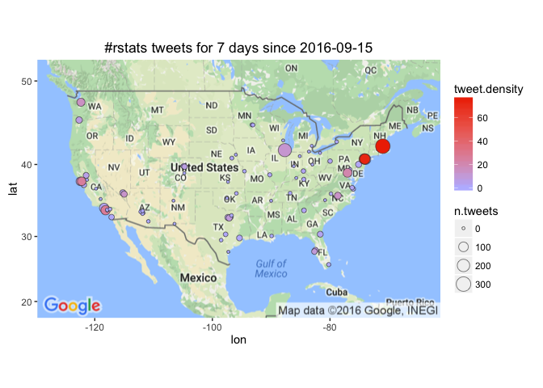

# High Performance Reverse-Geo-Coding Model
Winston Saunders  
September 22, 2016  

# Summary

A quesiton was asked on the Sept ["Not So Standard Deviations"](https://www.patreon.com/NSSDeviations) podcast about the "best city for data science."" I use the `twitteR` package to measure interest in __R__ by computing the frequency and desity of tweets with the `#rstats` hashtag. Surprisingly, Boston, with a tweet density of over 75 #rstat tweets per million residents per day. Other leading cities include Jersey City and Newark, Oakland, Washington DC, Seattle, San Francisco, and Henderson, NV. 
Data are sensitive to assumptions about metro size. This was quick and dirty so no telling how stable the result will be over time. 


# Problem Statement

On their September Podcast, Hilary and Roger discussed the best city for data science. I've nvever met a person from SF who didn't think SF was the best at everything. So I decided to try measuring something. 


# How do I get City Data?

City coordinates and populations are available in the super-convenient  [`{maps}`](https://cran.r-project.org/web/packages/maps/index.html) package, which contains all the information we need for plotting and normalizing tweet data. 


```r
    require(maps)
    cities <- us.cities
    
    ## create city_name by removing state designnator
    cities <- cities %>% mutate(city_name = gsub(' [A-Z]{2,}','', name))
    ## clean
    cities <- cities[complete.cases(cities),] %>% as_data_frame
    ## sort
    cities <- cities[order(cities$pop, decreasing = TRUE), ]
```
 
The top cities by population are:  

<!-- html table generated in R 3.3.0 by xtable 1.8-2 package -->
<!--  -->
<table border=1>
<tr> <th> name </th> <th> country.etc </th> <th> pop </th> <th> lat </th> <th> long </th> <th> capital </th> <th> city_name </th>  </tr>
  <tr> <td align="right"> New York NY </td> <td align="center"> NY </td> <td align="center"> 8124427 </td> <td align="center"> 40.67 </td> <td align="center"> -73.94 </td> <td align="center">   0 </td> <td align="center"> New York </td> </tr>
  <tr> <td align="right"> Los Angeles CA </td> <td align="center"> CA </td> <td align="center"> 3911500 </td> <td align="center"> 34.11 </td> <td align="center"> -118.41 </td> <td align="center">   0 </td> <td align="center"> Los Angeles </td> </tr>
  <tr> <td align="right"> Chicago IL </td> <td align="center"> IL </td> <td align="center"> 2830144 </td> <td align="center"> 41.84 </td> <td align="center"> -87.68 </td> <td align="center">   0 </td> <td align="center"> Chicago </td> </tr>
  <tr> <td align="right"> Houston TX </td> <td align="center"> TX </td> <td align="center"> 2043005 </td> <td align="center"> 29.77 </td> <td align="center"> -95.39 </td> <td align="center">   0 </td> <td align="center"> Houston </td> </tr>
  <tr> <td align="right"> Phoenix AZ </td> <td align="center"> AZ </td> <td align="center"> 1450884 </td> <td align="center"> 33.54 </td> <td align="center"> -112.07 </td> <td align="center">   2 </td> <td align="center"> Phoenix </td> </tr>
  <tr> <td align="right"> Philadelphia PA </td> <td align="center"> PA </td> <td align="center"> 1439814 </td> <td align="center"> 40.01 </td> <td align="center"> -75.13 </td> <td align="center">   0 </td> <td align="center"> Philadelphia </td> </tr>
  <tr> <td align="right"> San Diego CA </td> <td align="center"> CA </td> <td align="center"> 1299352 </td> <td align="center"> 32.81 </td> <td align="center"> -117.14 </td> <td align="center">   0 </td> <td align="center"> San Diego </td> </tr>
  <tr> <td align="right"> San Antonio TX </td> <td align="center"> TX </td> <td align="center"> 1278171 </td> <td align="center"> 29.46 </td> <td align="center"> -98.51 </td> <td align="center">   0 </td> <td align="center"> San Antonio </td> </tr>
  <tr> <td align="right"> Dallas TX </td> <td align="center"> TX </td> <td align="center"> 1216543 </td> <td align="center"> 32.79 </td> <td align="center"> -96.77 </td> <td align="center">   0 </td> <td align="center"> Dallas </td> </tr>
  <tr> <td align="right"> San Jose CA </td> <td align="center"> CA </td> <td align="center"> 897883 </td> <td align="center"> 37.30 </td> <td align="center"> -121.85 </td> <td align="center">   0 </td> <td align="center"> San Jose </td> </tr>
   </table>

# What is required to set up the twitted API using the twitteR package?

Setting up the twitter API is relatively quick. Package functionality is tested by checking Michelle Obama's latest tweet.


```r
library(twitteR)
## create URLs
reqURL <- "https://api.twitter.com/oauth/request_token"
accessURL <- "https://api.twitter.com/oauth/access_token"
authURL <- "https://api.twitter.com/oauth/authorize"

## read file containing secret keys (obtained from apps.twitter.com)
keys <- read.table("/users/winstonsaunders/documents/city_politics/secret_t.key.txt")
## convert to characters
consumerKey <- keys[1,]%>%as.character()
consumerSecret <- keys[2,]%>%as.character()
accessToken <- keys[3,]%>%as.character()
accessTokenSecret <- keys[4,]%>%as.character()

## set up authentication
setup_twitter_oauth(consumerKey, consumerSecret, accessToken, accessTokenSecret)
```

```
## [1] "Using direct authentication"
```

```r
## test functionanlity
userTimeline(getUser('michelleobama'), n=1, includeRts=FALSE,excludeReplies=FALSE)
```

```
## [[1]]
## [1] "MichelleObama: “We can give all our children the bright, healthy futures they so richly deserve.” http://t.co/EgStdzksym #LetsMove"
```

# Getting the data

To get the tweet data use the `twitteR::searchTwiter` command. 
Data collection is with the following variables. Note the radius, which is used to localize tweet collected around specific geo-locations. In this amazingly crude initial case I chose a radius of 20 miles. For cases where major cities are in close proximity, this certainly picks up some redundant tweets. Life in the big leagues.


```r
## set up search terms
searchString.x <- "#rstats"    # search term
n.x <- 500                     # number of tweets
radius <- "20mi"               # radius around selected geo-location
duration.days <- 7             # how many days
since.date <- (Sys.Date() - duration.days) %>% as.character # calculated starting date
```

Collected data are put into  `collected_df`. For this first-pass analysis tweets are counted but are not cached.   


# Analysis

Once collected, the data are lightly analyzed. Specifically the 'tweet.density', representing the number of tweets per million people per day, is computed.


```r
analyzed_df <- collected_df %>% 
    mutate("tweet.density" = 10^6 * n.tweets/population/duration.days ) %>% 
    select(name, lon, lat, tweet.density, n.tweets, population)
```

# What is the Tweet Map?

Mapping uses the `{ggmap}` package. 



# What are the top cities by tweets adn densities?

here are the top few cities by tweet density

<!-- html table generated in R 3.3.0 by xtable 1.8-2 package -->
<!--  -->
<table border=1>
<tr> <th> name </th> <th> tweet.density </th> <th> n.tweets </th> <th> population </th>  </tr>
  <tr> <td> Boston MA </td> <td align="right"> 75.99 </td> <td align="right"> 302 </td> <td align="right"> 567759.00 </td> </tr>
  <tr> <td> Jersey City NJ </td> <td align="right"> 72.90 </td> <td align="right"> 121 </td> <td align="right"> 237125.00 </td> </tr>
  <tr> <td> Newark NJ </td> <td align="right"> 61.43 </td> <td align="right"> 121 </td> <td align="right"> 281378.00 </td> </tr>
  <tr> <td> Long Beach CA </td> <td align="right"> 26.72 </td> <td align="right">  91 </td> <td align="right"> 486571.00 </td> </tr>
  <tr> <td> Oakland CA </td> <td align="right"> 25.40 </td> <td align="right">  70 </td> <td align="right"> 393632.00 </td> </tr>
  <tr> <td> WASHINGTON DC </td> <td align="right"> 20.58 </td> <td align="right">  79 </td> <td align="right"> 548359.00 </td> </tr>
  <tr> <td> Seattle WA </td> <td align="right"> 14.78 </td> <td align="right">  59 </td> <td align="right"> 570430.00 </td> </tr>
  <tr> <td> Raleigh NC </td> <td align="right"> 13.85 </td> <td align="right">  34 </td> <td align="right"> 350822.00 </td> </tr>
  <tr> <td> San Francisco CA </td> <td align="right"> 13.82 </td> <td align="right">  70 </td> <td align="right"> 723724.00 </td> </tr>
  <tr> <td> Henderson NV </td> <td align="right"> 12.85 </td> <td align="right">  23 </td> <td align="right"> 255646.00 </td> </tr>
  <tr> <td> Chicago IL </td> <td align="right"> 11.76 </td> <td align="right"> 233 </td> <td align="right"> 2830144.00 </td> </tr>
  <tr> <td> Saint Petersburg FL </td> <td align="right"> 9.30 </td> <td align="right">  16 </td> <td align="right"> 245804.00 </td> </tr>
  <tr> <td> Arlington TX </td> <td align="right"> 9.15 </td> <td align="right">  24 </td> <td align="right"> 374729.00 </td> </tr>
  <tr> <td> Portland OR </td> <td align="right"> 7.11 </td> <td align="right">  27 </td> <td align="right"> 542751.00 </td> </tr>
  <tr> <td> Tampa FL </td> <td align="right"> 6.96 </td> <td align="right">  16 </td> <td align="right"> 328578.00 </td> </tr>
   </table>

here are the top few cities by tweets

<!-- html table generated in R 3.3.0 by xtable 1.8-2 package -->
<!--  -->
<table border=1>
<tr> <th> name </th> <th> tweet.density </th> <th> n.tweets </th> <th> population </th>  </tr>
  <tr> <td> Boston MA </td> <td align="right"> 75.99 </td> <td align="right"> 302 </td> <td align="right"> 567759.00 </td> </tr>
  <tr> <td> Chicago IL </td> <td align="right"> 11.76 </td> <td align="right"> 233 </td> <td align="right"> 2830144.00 </td> </tr>
  <tr> <td> New York NY </td> <td align="right"> 2.13 </td> <td align="right"> 121 </td> <td align="right"> 8124427.00 </td> </tr>
  <tr> <td> Newark NJ </td> <td align="right"> 61.43 </td> <td align="right"> 121 </td> <td align="right"> 281378.00 </td> </tr>
  <tr> <td> Jersey City NJ </td> <td align="right"> 72.90 </td> <td align="right"> 121 </td> <td align="right"> 237125.00 </td> </tr>
  <tr> <td> Los Angeles CA </td> <td align="right"> 3.32 </td> <td align="right">  91 </td> <td align="right"> 3911500.00 </td> </tr>
  <tr> <td> Long Beach CA </td> <td align="right"> 26.72 </td> <td align="right">  91 </td> <td align="right"> 486571.00 </td> </tr>
  <tr> <td> WASHINGTON DC </td> <td align="right"> 20.58 </td> <td align="right">  79 </td> <td align="right"> 548359.00 </td> </tr>
  <tr> <td> San Francisco CA </td> <td align="right"> 13.82 </td> <td align="right">  70 </td> <td align="right"> 723724.00 </td> </tr>
  <tr> <td> Oakland CA </td> <td align="right"> 25.40 </td> <td align="right">  70 </td> <td align="right"> 393632.00 </td> </tr>
  <tr> <td> Seattle WA </td> <td align="right"> 14.78 </td> <td align="right">  59 </td> <td align="right"> 570430.00 </td> </tr>
  <tr> <td> Raleigh NC </td> <td align="right"> 13.85 </td> <td align="right">  34 </td> <td align="right"> 350822.00 </td> </tr>
  <tr> <td> Portland OR </td> <td align="right"> 7.11 </td> <td align="right">  27 </td> <td align="right"> 542751.00 </td> </tr>
  <tr> <td> Arlington TX </td> <td align="right"> 9.15 </td> <td align="right">  24 </td> <td align="right"> 374729.00 </td> </tr>
  <tr> <td> Philadelphia PA </td> <td align="right"> 2.28 </td> <td align="right">  23 </td> <td align="right"> 1439814.00 </td> </tr>
   </table>


