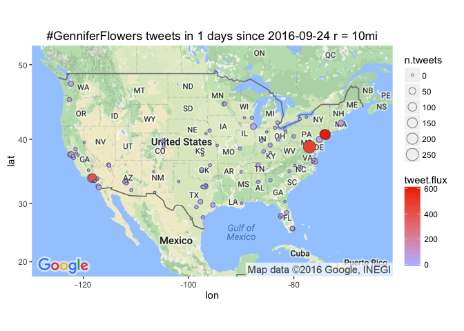

# Leading Cities in #MAGA tweet flux
Winston Saunders  
September 23, 2016  

# setup


```r
## set up search terms
searchString.x <- "#GenniferFlowers"    # search term
n.x <- 3000                     # number of tweets
radius <- "10mi"               # radius around selected geo-location
duration.days <- 1             # how many days
since.date <- (Sys.Date() - duration.days) %>% as.character # calculated starting date
```

# #GenniferFlowers geo-preference.


```
[1] "Using direct authentication"
```


 


 


Use the `twitteR::searchTwitter` command. 


```r
n.cities <- 100
```

Data collection for the top 100 cities (by population) in the U.S. This includes cities from New York NY to Irvine CA.


# Tweet-Map for #GenniferFlowers?


```r
map.plot +
    geom_point(aes(x = lon, y = lat, fill = tweet.flux, size = n.tweets), data=analyzed_df, pch=21, color = "#33333399") +
    ggtitle(paste0(searchString.x, " tweets in ", duration.days," days since ", since.date, " r = ", radius)) +
    scale_fill_gradient(low = "#BBBBFF", high = "#EE3300", space = "Lab", na.value = "grey50", guide = "colourbar")
```




## #GenniferFlowers AMB tweet-flux

Here are the top few cities by tweet flux (in "twipermipeds").

<!-- html table generated in R 3.3.0 by xtable 1.8-2 package -->
<!--  -->
<table border=1>
<tr> <th> name </th> <th> tweet.flux </th> <th> n.tweets </th> <th> population </th>  </tr>
  <tr> <td> Jersey City NJ </td> <td align="right"> 611.49 </td> <td align="right"> 145 </td> <td align="right"> 237125 </td> </tr>
  <tr> <td> WASHINGTON DC </td> <td align="right"> 481.44 </td> <td align="right"> 264 </td> <td align="right"> 548359 </td> </tr>
  <tr> <td> Newark NJ </td> <td align="right"> 447.80 </td> <td align="right"> 126 </td> <td align="right"> 281378 </td> </tr>
  <tr> <td> Glendale CA </td> <td align="right"> 405.38 </td> <td align="right">  83 </td> <td align="right"> 204747 </td> </tr>
  <tr> <td> Virginia Beach VA </td> <td align="right"> 81.52 </td> <td align="right">  37 </td> <td align="right"> 453884 </td> </tr>
  <tr> <td> Oakland CA </td> <td align="right"> 66.05 </td> <td align="right">  26 </td> <td align="right"> 393632 </td> </tr>
  <tr> <td> Chula Vista CA </td> <td align="right"> 63.14 </td> <td align="right">  14 </td> <td align="right"> 221736 </td> </tr>
  <tr> <td> Boston MA </td> <td align="right"> 56.36 </td> <td align="right">  32 </td> <td align="right"> 567759 </td> </tr>
  <tr> <td> Tampa FL </td> <td align="right"> 51.74 </td> <td align="right">  17 </td> <td align="right"> 328578 </td> </tr>
  <tr> <td> Hialeah FL </td> <td align="right"> 44.51 </td> <td align="right">  10 </td> <td align="right"> 224644 </td> </tr>
  <tr> <td> Orlando FL </td> <td align="right"> 42.61 </td> <td align="right">   9 </td> <td align="right"> 211226 </td> </tr>
  <tr> <td> San Francisco CA </td> <td align="right"> 34.54 </td> <td align="right">  25 </td> <td align="right"> 723724 </td> </tr>
  <tr> <td> Seattle WA </td> <td align="right"> 33.31 </td> <td align="right">  19 </td> <td align="right"> 570430 </td> </tr>
  <tr> <td> Miami FL </td> <td align="right"> 25.86 </td> <td align="right">  10 </td> <td align="right"> 386740 </td> </tr>
  <tr> <td> Los Angeles CA </td> <td align="right"> 25.05 </td> <td align="right">  98 </td> <td align="right"> 3911500 </td> </tr>
   </table>

## #GenniferFlowers AMB tweet count

Here are the top few cities sorted by raw tweets, again with major metro areas leading. Note that some other cities, like Chicago, have a large number of tweets but a lower flux because of their higher population.

<!-- html table generated in R 3.3.0 by xtable 1.8-2 package -->
<!--  -->
<table border=1>
<tr> <th> name </th> <th> tweet.flux </th> <th> n.tweets </th> <th> population </th>  </tr>
  <tr> <td> WASHINGTON DC </td> <td align="right"> 481.44 </td> <td align="right"> 264 </td> <td align="right"> 548359 </td> </tr>
  <tr> <td> New York NY </td> <td align="right"> 17.97 </td> <td align="right"> 146 </td> <td align="right"> 8124427 </td> </tr>
  <tr> <td> Jersey City NJ </td> <td align="right"> 611.49 </td> <td align="right"> 145 </td> <td align="right"> 237125 </td> </tr>
  <tr> <td> Newark NJ </td> <td align="right"> 447.80 </td> <td align="right"> 126 </td> <td align="right"> 281378 </td> </tr>
  <tr> <td> Los Angeles CA </td> <td align="right"> 25.05 </td> <td align="right">  98 </td> <td align="right"> 3911500 </td> </tr>
  <tr> <td> Glendale CA </td> <td align="right"> 405.38 </td> <td align="right">  83 </td> <td align="right"> 204747 </td> </tr>
  <tr> <td> Virginia Beach VA </td> <td align="right"> 81.52 </td> <td align="right">  37 </td> <td align="right"> 453884 </td> </tr>
  <tr> <td> Philadelphia PA </td> <td align="right"> 25.00 </td> <td align="right">  36 </td> <td align="right"> 1439814 </td> </tr>
  <tr> <td> Boston MA </td> <td align="right"> 56.36 </td> <td align="right">  32 </td> <td align="right"> 567759 </td> </tr>
  <tr> <td> Chicago IL </td> <td align="right"> 10.95 </td> <td align="right">  31 </td> <td align="right"> 2830144 </td> </tr>
  <tr> <td> Oakland CA </td> <td align="right"> 66.05 </td> <td align="right">  26 </td> <td align="right"> 393632 </td> </tr>
  <tr> <td> San Francisco CA </td> <td align="right"> 34.54 </td> <td align="right">  25 </td> <td align="right"> 723724 </td> </tr>
  <tr> <td> Seattle WA </td> <td align="right"> 33.31 </td> <td align="right">  19 </td> <td align="right"> 570430 </td> </tr>
  <tr> <td> Tampa FL </td> <td align="right"> 51.74 </td> <td align="right">  17 </td> <td align="right"> 328578 </td> </tr>
  <tr> <td> Dallas TX </td> <td align="right"> 13.15 </td> <td align="right">  16 </td> <td align="right"> 1216543 </td> </tr>
   </table>

  
  


