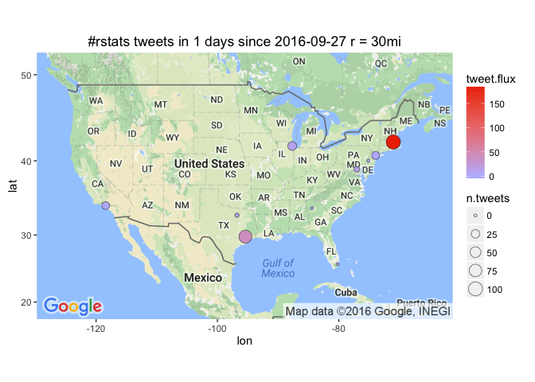

# Leading Metro Areas with #rstats tweet flux
Winston Saunders  
September 23, 2016  

# setup


```r
## set up search terms
searchString.x <- "#rstats"    # search term
n.x <- 3000                     # number of tweets
radius <- "30mi"               # radius around selected geo-location
duration.days <- 1             # how many days
since.date <- (Sys.Date() - duration.days) %>% as.character # calculated starting date
```

# #rstats geo-preference.


```
[1] "Using direct authentication"
```


Get city geo data from `maps::cities`


Use the `twitteR::searchTwitter` command. 


```r
n.cities <- 10
```

Data collection for the top 10 cities (by population) in the U.S. This includes cities from New York NY to Boston MA.


# Tweet-Map for #rstats?


```r
map.plot +
    geom_point(aes(x = lon, y = lat, fill = tweet.flux, size = n.tweets), data=analyzed_df, pch=21, color = "#33333399") +
    ggtitle(paste0(searchString.x, " tweets in ", duration.days," days since ", since.date, " r = ", radius)) +
    scale_fill_gradient(low = "#BBBBFF", high = "#EE3300", space = "Lab", na.value = "grey50", guide = "colourbar")
```




## #rstats AMB tweet-flux

Here are the top few cities by tweet flux (in "twipermipeds").

<!-- html table generated in R 3.3.0 by xtable 1.8-2 package -->
<!--  -->
<table border=1>
<tr> <th> name </th> <th> tweet.flux </th> <th> n.tweets </th> <th> population </th>  </tr>
  <tr> <td> Boston MA </td> <td align="right"> 188.46 </td> <td align="right"> 107 </td> <td align="right"> 567759 </td> </tr>
  <tr> <td> Houston TX </td> <td align="right"> 40.14 </td> <td align="right">  82 </td> <td align="right"> 2043005 </td> </tr>
  <tr> <td> WASHINGTON DC </td> <td align="right"> 10.94 </td> <td align="right">   6 </td> <td align="right"> 548359 </td> </tr>
  <tr> <td> Chicago IL </td> <td align="right"> 9.89 </td> <td align="right">  28 </td> <td align="right"> 2830144 </td> </tr>
  <tr> <td> Los Angeles CA </td> <td align="right"> 4.86 </td> <td align="right">  19 </td> <td align="right"> 3911500 </td> </tr>
  <tr> <td> New York NY </td> <td align="right"> 2.46 </td> <td align="right">  20 </td> <td align="right"> 8124427 </td> </tr>
  <tr> <td> Dallas TX </td> <td align="right"> 0.82 </td> <td align="right">   1 </td> <td align="right"> 1216543 </td> </tr>
  <tr> <td> Philadelphia PA </td> <td align="right"> 0.00 </td> <td align="right">   0 </td> <td align="right"> 1439814 </td> </tr>
  <tr> <td> Miami FL </td> <td align="right"> 0.00 </td> <td align="right">   0 </td> <td align="right"> 386740 </td> </tr>
  <tr> <td> Atlanta GA </td> <td align="right"> 0.00 </td> <td align="right">   0 </td> <td align="right"> 424096 </td> </tr>
   </table>

## #rstats AMB tweet count

Here are the top few cities sorted by raw tweets, again with major metro areas leading. Note that some other cities, like Chicago, have a large number of tweets but a lower flux because of their higher population.

<!-- html table generated in R 3.3.0 by xtable 1.8-2 package -->
<!--  -->
<table border=1>
<tr> <th> name </th> <th> tweet.flux </th> <th> n.tweets </th> <th> population </th>  </tr>
  <tr> <td> Boston MA </td> <td align="right"> 188.46 </td> <td align="right"> 107 </td> <td align="right"> 567759 </td> </tr>
  <tr> <td> Houston TX </td> <td align="right"> 40.14 </td> <td align="right">  82 </td> <td align="right"> 2043005 </td> </tr>
  <tr> <td> Chicago IL </td> <td align="right"> 9.89 </td> <td align="right">  28 </td> <td align="right"> 2830144 </td> </tr>
  <tr> <td> New York NY </td> <td align="right"> 2.46 </td> <td align="right">  20 </td> <td align="right"> 8124427 </td> </tr>
  <tr> <td> Los Angeles CA </td> <td align="right"> 4.86 </td> <td align="right">  19 </td> <td align="right"> 3911500 </td> </tr>
  <tr> <td> WASHINGTON DC </td> <td align="right"> 10.94 </td> <td align="right">   6 </td> <td align="right"> 548359 </td> </tr>
  <tr> <td> Dallas TX </td> <td align="right"> 0.82 </td> <td align="right">   1 </td> <td align="right"> 1216543 </td> </tr>
  <tr> <td> Philadelphia PA </td> <td align="right"> 0.00 </td> <td align="right">   0 </td> <td align="right"> 1439814 </td> </tr>
  <tr> <td> Miami FL </td> <td align="right"> 0.00 </td> <td align="right">   0 </td> <td align="right"> 386740 </td> </tr>
  <tr> <td> Atlanta GA </td> <td align="right"> 0.00 </td> <td align="right">   0 </td> <td align="right"> 424096 </td> </tr>
   </table>

  
  


