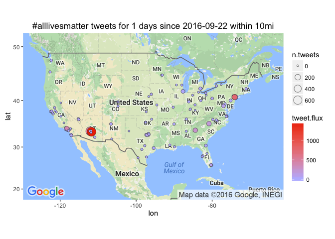

# Leading Cities in #blacklivesmatter tweet flux
Winston Saunders  
September 23, 2016  

# get Tweets


```r
## set up search terms
searchString.x <- "#alllivesmatter"    # search term
n.x <- 3000                     # number of tweets
radius <- "10mi"               # radius around selected geo-location
duration.days <- 1             # how many days
since.date <- (Sys.Date() - duration.days) %>% as.character # calculated starting date
```

looking at #alllivesmatter for geo preference.


```
[1] "Using direct authentication"
```


 


 


To get the tweet data use the `twitteR::searchTwiter` command. 
Data collection is with the following variables. 


```r
n.cities <- 100
```

```
[1] "Rate limited .... blocking for a minute and retrying up to 119 times ..."
[1] "Rate limited .... blocking for a minute and retrying up to 118 times ..."
[1] "Rate limited .... blocking for a minute and retrying up to 117 times ..."
[1] "Rate limited .... blocking for a minute and retrying up to 116 times ..."
[1] "Rate limited .... blocking for a minute and retrying up to 115 times ..."
[1] "Rate limited .... blocking for a minute and retrying up to 114 times ..."
[1] "Rate limited .... blocking for a minute and retrying up to 113 times ..."
[1] "Rate limited .... blocking for a minute and retrying up to 112 times ..."
[1] "Rate limited .... blocking for a minute and retrying up to 111 times ..."
```

Data for the top 100 cities (by population) in the U.S. This includes cities from New York NY to Irvine CA.


# Tweet-Map for #alllivesmatter?


```r
map.plot +
    geom_point(aes(x = lon, y = lat, fill = tweet.flux, size = n.tweets), data=analyzed_df, pch=21, color = "#33333399") +
    ggtitle(paste0(searchString.x, " tweets for ", duration.days," days since ", since.date, " within ", radius)) +
    scale_fill_gradient(low = "#BBBBFF", high = "#EE3300", space = "Lab", na.value = "grey50", guide = "colourbar")
```




## AMB tweet-flux

Here are the top few cities by tweet flux (in "twipermipeds").

<!-- html table generated in R 3.3.0 by xtable 1.8-2 package -->
<!--  -->
<table border=1>
<tr> <th> name </th> <th> tweet.flux </th> <th> n.tweets </th> <th> population </th>  </tr>
  <tr> <td> Mesa AZ </td> <td align="right"> 1494.04 </td> <td align="right"> 689 </td> <td align="right"> 461167 </td> </tr>
  <tr> <td> Jersey City NJ </td> <td align="right"> 738.01 </td> <td align="right"> 175 </td> <td align="right"> 237125 </td> </tr>
  <tr> <td> Newark NJ </td> <td align="right"> 490.44 </td> <td align="right"> 138 </td> <td align="right"> 281378 </td> </tr>
  <tr> <td> Phoenix AZ </td> <td align="right"> 483.15 </td> <td align="right"> 701 </td> <td align="right"> 1450884 </td> </tr>
  <tr> <td> Glendale CA </td> <td align="right"> 395.61 </td> <td align="right">  81 </td> <td align="right"> 204747 </td> </tr>
  <tr> <td> Atlanta GA </td> <td align="right"> 249.94 </td> <td align="right"> 106 </td> <td align="right"> 424096 </td> </tr>
  <tr> <td> Charlotte NC </td> <td align="right"> 184.48 </td> <td align="right"> 112 </td> <td align="right"> 607111 </td> </tr>
  <tr> <td> WASHINGTON DC </td> <td align="right"> 96.65 </td> <td align="right">  53 </td> <td align="right"> 548359 </td> </tr>
  <tr> <td> Hialeah FL </td> <td align="right"> 93.48 </td> <td align="right">  21 </td> <td align="right"> 224644 </td> </tr>
  <tr> <td> Arlington TX </td> <td align="right"> 80.06 </td> <td align="right">  30 </td> <td align="right"> 374729 </td> </tr>
  <tr> <td> Chula Vista CA </td> <td align="right"> 63.14 </td> <td align="right">  14 </td> <td align="right"> 221736 </td> </tr>
  <tr> <td> Paradise NV </td> <td align="right"> 58.81 </td> <td align="right">  13 </td> <td align="right"> 221051 </td> </tr>
  <tr> <td> Miami FL </td> <td align="right"> 56.89 </td> <td align="right">  22 </td> <td align="right"> 386740 </td> </tr>
  <tr> <td> Oakland CA </td> <td align="right"> 53.35 </td> <td align="right">  21 </td> <td align="right"> 393632 </td> </tr>
  <tr> <td> Pittsburgh PA </td> <td align="right"> 47.43 </td> <td align="right">  15 </td> <td align="right"> 316272 </td> </tr>
   </table>

## AMB tweet count

Here are the top few cities sorted by raw tweets, again with major metro areas leading. Note that some other cities, like Chicago, have a large number of tweets but a lower flux because of their higher population.

<!-- html table generated in R 3.3.0 by xtable 1.8-2 package -->
<!--  -->
<table border=1>
<tr> <th> name </th> <th> tweet.flux </th> <th> n.tweets </th> <th> population </th>  </tr>
  <tr> <td> Phoenix AZ </td> <td align="right"> 483.15 </td> <td align="right"> 701 </td> <td align="right"> 1450884 </td> </tr>
  <tr> <td> Mesa AZ </td> <td align="right"> 1494.04 </td> <td align="right"> 689 </td> <td align="right"> 461167 </td> </tr>
  <tr> <td> New York NY </td> <td align="right"> 21.66 </td> <td align="right"> 176 </td> <td align="right"> 8124427 </td> </tr>
  <tr> <td> Jersey City NJ </td> <td align="right"> 738.01 </td> <td align="right"> 175 </td> <td align="right"> 237125 </td> </tr>
  <tr> <td> Newark NJ </td> <td align="right"> 490.44 </td> <td align="right"> 138 </td> <td align="right"> 281378 </td> </tr>
  <tr> <td> Charlotte NC </td> <td align="right"> 184.48 </td> <td align="right"> 112 </td> <td align="right"> 607111 </td> </tr>
  <tr> <td> Atlanta GA </td> <td align="right"> 249.94 </td> <td align="right"> 106 </td> <td align="right"> 424096 </td> </tr>
  <tr> <td> Los Angeles CA </td> <td align="right"> 23.26 </td> <td align="right">  91 </td> <td align="right"> 3911500 </td> </tr>
  <tr> <td> Glendale CA </td> <td align="right"> 395.61 </td> <td align="right">  81 </td> <td align="right"> 204747 </td> </tr>
  <tr> <td> Chicago IL </td> <td align="right"> 21.55 </td> <td align="right">  61 </td> <td align="right"> 2830144 </td> </tr>
  <tr> <td> WASHINGTON DC </td> <td align="right"> 96.65 </td> <td align="right">  53 </td> <td align="right"> 548359 </td> </tr>
  <tr> <td> Dallas TX </td> <td align="right"> 33.70 </td> <td align="right">  41 </td> <td align="right"> 1216543 </td> </tr>
  <tr> <td> Detroit MI </td> <td align="right"> 40.15 </td> <td align="right">  35 </td> <td align="right"> 871789 </td> </tr>
  <tr> <td> Arlington TX </td> <td align="right"> 80.06 </td> <td align="right">  30 </td> <td align="right"> 374729 </td> </tr>
  <tr> <td> Fort Worth TX </td> <td align="right"> 45.75 </td> <td align="right">  29 </td> <td align="right"> 633849 </td> </tr>
   </table>

  
  


