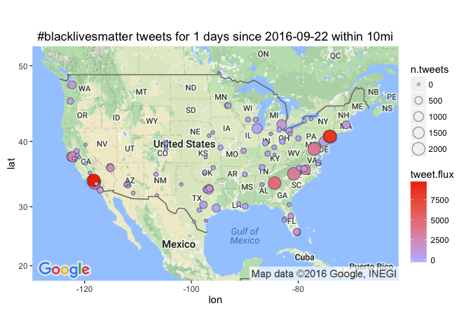

# Leading Cities in #blacklivesmatter tweet flux
Winston Saunders  
September 23, 2016  

# get Tweets


```r
## set up search terms
searchString.x <- "#blacklivesmatter"    # search term
n.x <- 2000                     # number of tweets
radius <- "10mi"               # radius around selected geo-location
duration.days <- 1             # how many days
since.date <- (Sys.Date() - duration.days) %>% as.character # calculated starting date
```

looking at #blacklivesmatter for geo preference.


```
[1] "Using direct authentication"
```


 


 


To get the tweet data use the `twitteR::searchTwiter` command. 
Data collection is with the following variables. 


```r
n.cities <- 100
```

```
[1] "Rate limited .... blocking for a minute and retrying up to 119 times ..."
[1] "Rate limited .... blocking for a minute and retrying up to 118 times ..."
[1] "Rate limited .... blocking for a minute and retrying up to 117 times ..."
[1] "Rate limited .... blocking for a minute and retrying up to 116 times ..."
[1] "Rate limited .... blocking for a minute and retrying up to 115 times ..."
[1] "Rate limited .... blocking for a minute and retrying up to 114 times ..."
[1] "Rate limited .... blocking for a minute and retrying up to 113 times ..."
[1] "Rate limited .... blocking for a minute and retrying up to 112 times ..."
[1] "Rate limited .... blocking for a minute and retrying up to 111 times ..."
[1] "Rate limited .... blocking for a minute and retrying up to 110 times ..."
[1] "Rate limited .... blocking for a minute and retrying up to 109 times ..."
[1] "Rate limited .... blocking for a minute and retrying up to 119 times ..."
[1] "Rate limited .... blocking for a minute and retrying up to 118 times ..."
[1] "Rate limited .... blocking for a minute and retrying up to 117 times ..."
[1] "Rate limited .... blocking for a minute and retrying up to 116 times ..."
[1] "Rate limited .... blocking for a minute and retrying up to 115 times ..."
[1] "Rate limited .... blocking for a minute and retrying up to 114 times ..."
[1] "Rate limited .... blocking for a minute and retrying up to 113 times ..."
[1] "Rate limited .... blocking for a minute and retrying up to 112 times ..."
[1] "Rate limited .... blocking for a minute and retrying up to 111 times ..."
[1] "Rate limited .... blocking for a minute and retrying up to 110 times ..."
[1] "Rate limited .... blocking for a minute and retrying up to 109 times ..."
```

Data for the top 100 cities (by population) in the U.S. This includes cities from New York NY to Irvine CA.


# Tweet-Map for #blacklivesmatter?


```r
map.plot +
    geom_point(aes(x = lon, y = lat, fill = tweet.flux, size = n.tweets), data=analyzed_df, pch=21, color = "#33333399") +
    ggtitle(paste0(searchString.x, " tweets for ", duration.days," days since ", since.date, " within ", radius)) +
    scale_fill_gradient(low = "#BBBBFF", high = "#EE3300", space = "Lab", na.value = "grey50", guide = "colourbar")
```




## AMB tweet-flux

Here are the top few cities by tweet flux (in "twipermipeds").

<!-- html table generated in R 3.3.0 by xtable 1.8-2 package -->
<!--  -->
<table border=1>
<tr> <th> name </th> <th> tweet.flux </th> <th> n.tweets </th> <th> population </th>  </tr>
  <tr> <td> Glendale CA </td> <td align="right"> 9768.15 </td> <td align="right"> 2000 </td> <td align="right"> 204747 </td> </tr>
  <tr> <td> Jersey City NJ </td> <td align="right"> 8434.37 </td> <td align="right"> 2000 </td> <td align="right"> 237125 </td> </tr>
  <tr> <td> Newark NJ </td> <td align="right"> 7107.88 </td> <td align="right"> 2000 </td> <td align="right"> 281378 </td> </tr>
  <tr> <td> Atlanta GA </td> <td align="right"> 4715.91 </td> <td align="right"> 2000 </td> <td align="right"> 424096 </td> </tr>
  <tr> <td> Long Beach CA </td> <td align="right"> 4110.40 </td> <td align="right"> 2000 </td> <td align="right"> 486571 </td> </tr>
  <tr> <td> WASHINGTON DC </td> <td align="right"> 3647.25 </td> <td align="right"> 2000 </td> <td align="right"> 548359 </td> </tr>
  <tr> <td> Charlotte NC </td> <td align="right"> 3292.64 </td> <td align="right"> 1999 </td> <td align="right"> 607111 </td> </tr>
  <tr> <td> Raleigh NC </td> <td align="right"> 2904.61 </td> <td align="right"> 1019 </td> <td align="right"> 350822 </td> </tr>
  <tr> <td> Oakland CA </td> <td align="right"> 2807.19 </td> <td align="right"> 1105 </td> <td align="right"> 393632 </td> </tr>
  <tr> <td> Paradise NV </td> <td align="right"> 2130.73 </td> <td align="right"> 471 </td> <td align="right"> 221051 </td> </tr>
  <tr> <td> Hialeah FL </td> <td align="right"> 1718.27 </td> <td align="right"> 386 </td> <td align="right"> 224644 </td> </tr>
  <tr> <td> Garland TX </td> <td align="right"> 1649.75 </td> <td align="right"> 359 </td> <td align="right"> 217609 </td> </tr>
  <tr> <td> Durham NC </td> <td align="right"> 1444.16 </td> <td align="right"> 301 </td> <td align="right"> 208426 </td> </tr>
  <tr> <td> San Francisco CA </td> <td align="right"> 1374.83 </td> <td align="right"> 995 </td> <td align="right"> 723724 </td> </tr>
  <tr> <td> Baltimore MD </td> <td align="right"> 1173.14 </td> <td align="right"> 707 </td> <td align="right"> 602658 </td> </tr>
   </table>

## AMB tweet count

Here are the top few cities sorted by raw tweets, again with major metro areas leading. Note that some other cities, like Chicago, have a large number of tweets but a lower flux because of their higher population.

<!-- html table generated in R 3.3.0 by xtable 1.8-2 package -->
<!--  -->
<table border=1>
<tr> <th> name </th> <th> tweet.flux </th> <th> n.tweets </th> <th> population </th>  </tr>
  <tr> <td> New York NY </td> <td align="right"> 246.17 </td> <td align="right"> 2000 </td> <td align="right"> 8124427 </td> </tr>
  <tr> <td> Los Angeles CA </td> <td align="right"> 511.31 </td> <td align="right"> 2000 </td> <td align="right"> 3911500 </td> </tr>
  <tr> <td> WASHINGTON DC </td> <td align="right"> 3647.25 </td> <td align="right"> 2000 </td> <td align="right"> 548359 </td> </tr>
  <tr> <td> Long Beach CA </td> <td align="right"> 4110.40 </td> <td align="right"> 2000 </td> <td align="right"> 486571 </td> </tr>
  <tr> <td> Atlanta GA </td> <td align="right"> 4715.91 </td> <td align="right"> 2000 </td> <td align="right"> 424096 </td> </tr>
  <tr> <td> Newark NJ </td> <td align="right"> 7107.88 </td> <td align="right"> 2000 </td> <td align="right"> 281378 </td> </tr>
  <tr> <td> Jersey City NJ </td> <td align="right"> 8434.37 </td> <td align="right"> 2000 </td> <td align="right"> 237125 </td> </tr>
  <tr> <td> Glendale CA </td> <td align="right"> 9768.15 </td> <td align="right"> 2000 </td> <td align="right"> 204747 </td> </tr>
  <tr> <td> Charlotte NC </td> <td align="right"> 3292.64 </td> <td align="right"> 1999 </td> <td align="right"> 607111 </td> </tr>
  <tr> <td> Chicago IL </td> <td align="right"> 397.51 </td> <td align="right"> 1125 </td> <td align="right"> 2830144 </td> </tr>
  <tr> <td> Oakland CA </td> <td align="right"> 2807.19 </td> <td align="right"> 1105 </td> <td align="right"> 393632 </td> </tr>
  <tr> <td> Philadelphia PA </td> <td align="right"> 750.79 </td> <td align="right"> 1081 </td> <td align="right"> 1439814 </td> </tr>
  <tr> <td> Detroit MI </td> <td align="right"> 1170.01 </td> <td align="right"> 1020 </td> <td align="right"> 871789 </td> </tr>
  <tr> <td> Raleigh NC </td> <td align="right"> 2904.61 </td> <td align="right"> 1019 </td> <td align="right"> 350822 </td> </tr>
  <tr> <td> Dallas TX </td> <td align="right"> 827.76 </td> <td align="right"> 1007 </td> <td align="right"> 1216543 </td> </tr>
   </table>

  
  


