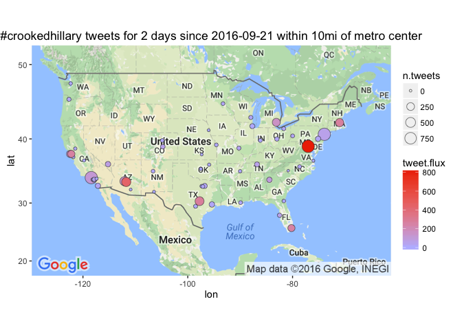

# Leading Cities in #crookedhillary tweet flux
Winston Saunders  
September 23, 2016  

# get Tweets


```r
## set up search terms
searchString.x <- "#crookedhillary"    # search term
n.x <- 900                     # number of tweets
radius <- "10mi"               # radius around selected geo-location
duration.days <- 2             # how many days
since.date <- (Sys.Date() - duration.days) %>% as.character # calculated starting date
```

looking at #crookedhillary for geo preference.


```
[1] "Using direct authentication"
```


 


 


To get the tweet data use the `twitteR::searchTwiter` command. 
Data collection is with the following variables. 


```r
n.cities <- 57
```

```
[1] "Rate limited .... blocking for a minute and retrying up to 119 times ..."
[1] "Rate limited .... blocking for a minute and retrying up to 118 times ..."
[1] "Rate limited .... blocking for a minute and retrying up to 117 times ..."
[1] "Rate limited .... blocking for a minute and retrying up to 116 times ..."
[1] "Rate limited .... blocking for a minute and retrying up to 115 times ..."
[1] "Rate limited .... blocking for a minute and retrying up to 114 times ..."
[1] "Rate limited .... blocking for a minute and retrying up to 113 times ..."
[1] "Rate limited .... blocking for a minute and retrying up to 112 times ..."
[1] "Rate limited .... blocking for a minute and retrying up to 111 times ..."
[1] "Rate limited .... blocking for a minute and retrying up to 110 times ..."
[1] "Rate limited .... blocking for a minute and retrying up to 109 times ..."
```

Data for the top 57 cities (by population) in the U.S. This includes cities from New York NY to Riverside CA.


# Tweet-Map for #crookedhillary?


```r
map.plot +
    geom_point(aes(x = lon, y = lat, fill = tweet.flux, size = n.tweets), data=analyzed_df, pch=21, color = "#33333399") +
    ggtitle(paste0(searchString.x, " tweets for ", duration.days," days since ", since.date, " within ", radius, " of metro center")) +
    scale_fill_gradient(low = "#BBBBFF", high = "#EE3300", space = "Lab", na.value = "grey50", guide = "colourbar")
```




## AMB tweet-flux

Here are the top few cities by tweet flux (in "twipermipeds").

<!-- html table generated in R 3.3.0 by xtable 1.8-2 package -->
<!--  -->
<table border=1>
<tr> <th> name </th> <th> tweet.flux </th> <th> n.tweets </th> <th> population </th>  </tr>
  <tr> <td> WASHINGTON DC </td> <td align="right"> 820.63 </td> <td align="right"> 900 </td> <td align="right"> 548359 </td> </tr>
  <tr> <td> Mesa AZ </td> <td align="right"> 444.52 </td> <td align="right"> 410 </td> <td align="right"> 461167 </td> </tr>
  <tr> <td> Austin TX </td> <td align="right"> 276.56 </td> <td align="right"> 378 </td> <td align="right"> 683404 </td> </tr>
  <tr> <td> Boston MA </td> <td align="right"> 266.84 </td> <td align="right"> 303 </td> <td align="right"> 567759 </td> </tr>
  <tr> <td> Oakland CA </td> <td align="right"> 259.13 </td> <td align="right"> 204 </td> <td align="right"> 393632 </td> </tr>
  <tr> <td> Miami FL </td> <td align="right"> 249.52 </td> <td align="right"> 193 </td> <td align="right"> 386740 </td> </tr>
  <tr> <td> Detroit MI </td> <td align="right"> 157.72 </td> <td align="right"> 275 </td> <td align="right"> 871789 </td> </tr>
  <tr> <td> Phoenix AZ </td> <td align="right"> 142.67 </td> <td align="right"> 414 </td> <td align="right"> 1450884 </td> </tr>
  <tr> <td> San Francisco CA </td> <td align="right"> 140.94 </td> <td align="right"> 204 </td> <td align="right"> 723724 </td> </tr>
  <tr> <td> Los Angeles CA </td> <td align="right"> 115.05 </td> <td align="right"> 900 </td> <td align="right"> 3911500 </td> </tr>
  <tr> <td> Atlanta GA </td> <td align="right"> 89.60 </td> <td align="right">  76 </td> <td align="right"> 424096 </td> </tr>
  <tr> <td> Las Vegas NV </td> <td align="right"> 70.42 </td> <td align="right">  78 </td> <td align="right"> 553807 </td> </tr>
  <tr> <td> Nashville TN </td> <td align="right"> 55.39 </td> <td align="right">  58 </td> <td align="right"> 523547 </td> </tr>
  <tr> <td> New York NY </td> <td align="right"> 55.39 </td> <td align="right"> 900 </td> <td align="right"> 8124427 </td> </tr>
  <tr> <td> Santa Ana CA </td> <td align="right"> 55.22 </td> <td align="right">  38 </td> <td align="right"> 344086 </td> </tr>
   </table>

## AMB tweet count

Here are the top few cities sorted by raw tweets, again with major metro areas leading. Note that some other cities, like Chicago, have a large number of tweets but a lower flux because of their higher population.

<!-- html table generated in R 3.3.0 by xtable 1.8-2 package -->
<!--  -->
<table border=1>
<tr> <th> name </th> <th> tweet.flux </th> <th> n.tweets </th> <th> population </th>  </tr>
  <tr> <td> New York NY </td> <td align="right"> 55.39 </td> <td align="right"> 900 </td> <td align="right"> 8124427 </td> </tr>
  <tr> <td> Los Angeles CA </td> <td align="right"> 115.05 </td> <td align="right"> 900 </td> <td align="right"> 3911500 </td> </tr>
  <tr> <td> WASHINGTON DC </td> <td align="right"> 820.63 </td> <td align="right"> 900 </td> <td align="right"> 548359 </td> </tr>
  <tr> <td> Phoenix AZ </td> <td align="right"> 142.67 </td> <td align="right"> 414 </td> <td align="right"> 1450884 </td> </tr>
  <tr> <td> Mesa AZ </td> <td align="right"> 444.52 </td> <td align="right"> 410 </td> <td align="right"> 461167 </td> </tr>
  <tr> <td> Austin TX </td> <td align="right"> 276.56 </td> <td align="right"> 378 </td> <td align="right"> 683404 </td> </tr>
  <tr> <td> Boston MA </td> <td align="right"> 266.84 </td> <td align="right"> 303 </td> <td align="right"> 567759 </td> </tr>
  <tr> <td> Detroit MI </td> <td align="right"> 157.72 </td> <td align="right"> 275 </td> <td align="right"> 871789 </td> </tr>
  <tr> <td> San Francisco CA </td> <td align="right"> 140.94 </td> <td align="right"> 204 </td> <td align="right"> 723724 </td> </tr>
  <tr> <td> Oakland CA </td> <td align="right"> 259.13 </td> <td align="right"> 204 </td> <td align="right"> 393632 </td> </tr>
  <tr> <td> Miami FL </td> <td align="right"> 249.52 </td> <td align="right"> 193 </td> <td align="right"> 386740 </td> </tr>
  <tr> <td> Houston TX </td> <td align="right"> 19.58 </td> <td align="right">  80 </td> <td align="right"> 2043005 </td> </tr>
  <tr> <td> Las Vegas NV </td> <td align="right"> 70.42 </td> <td align="right">  78 </td> <td align="right"> 553807 </td> </tr>
  <tr> <td> Atlanta GA </td> <td align="right"> 89.60 </td> <td align="right">  76 </td> <td align="right"> 424096 </td> </tr>
  <tr> <td> Philadelphia PA </td> <td align="right"> 25.35 </td> <td align="right">  73 </td> <td align="right"> 1439814 </td> </tr>
   </table>

  
  


