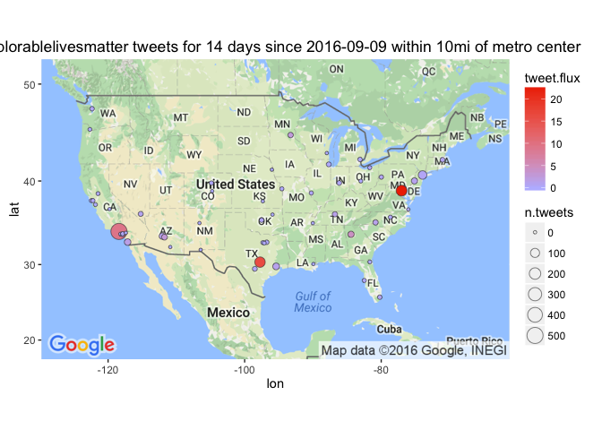

# Leading Cities in #deplorablelivesmatter Twipermipeds
Winston Saunders  
September 23, 2016  

# Summary

Looks at #deplorableLivesMatter


```r
## sorry this is a mess. I hacked another project

library(ggmap)
```

```
## Loading required package: ggplot2
```

```r
library(dplyr)
```

```
## 
## Attaching package: 'dplyr'
```

```
## The following objects are masked from 'package:stats':
## 
##     filter, lag
```

```
## The following objects are masked from 'package:base':
## 
##     intersect, setdiff, setequal, union
```

```r
library(googleway)
library(tidyr)
library(stringr)
library(xtable)
    options(xtable.floating = FALSE)
    options(xtable.timestamp = "")

library(googleway)

library(tidyr)
library(stringr)

library(gridExtra)
```

```
## 
## Attaching package: 'gridExtra'
```

```
## The following object is masked from 'package:dplyr':
## 
##     combine
```

```r
library(twitteR)
```

```
## 
## Attaching package: 'twitteR'
```

```
## The following objects are masked from 'package:dplyr':
## 
##     id, location
```

```r
require(plyr)
```

```
## Loading required package: plyr
```

```
## -------------------------------------------------------------------------
```

```
## You have loaded plyr after dplyr - this is likely to cause problems.
## If you need functions from both plyr and dplyr, please load plyr first, then dplyr:
## library(plyr); library(dplyr)
```

```
## -------------------------------------------------------------------------
```

```
## 
## Attaching package: 'plyr'
```

```
## The following object is masked from 'package:twitteR':
## 
##     id
```

```
## The following objects are masked from 'package:dplyr':
## 
##     arrange, count, desc, failwith, id, mutate, rename, summarise,
##     summarize
```

```r
library(methods)
library(maps)
```

```
## 
## Attaching package: 'maps'
```

```
## The following object is masked from 'package:plyr':
## 
##     ozone
```

```r
    options(scipen=999)
```


```r
## set up search terms
searchString.x <- "#deplorablelivesmatter"    # search term
n.x <- 900                     # number of tweets
radius <- "10mi"               # radius around selected geo-location
duration.days <- 14             # how many days
since.date <- (Sys.Date() - duration.days) %>% as.character # calculated starting date
```


```
## [1] "Using direct authentication"
```


 


 


```r
#print(xtable(head(cities, 4), align = c("r","r", "c", "c", "c", "c", "c", "c")), type="html", include.rownames=FALSE, include.colnames = TRUE)
```


## Getting the tweets

To get the tweet data use the `twitteR::searchTwiter` command. 
Data collection is with the following variables. 


Note the radius of 10mi, which is used to localize tweet collected around specific geo-locations.  For cases, where major cities are in close proximity, this certainly picks up some redundant tweets. More work needed here...


```r
n.cities <- 57
```

```
## Warning in doRppAPICall("search/tweets", n, params = params,
## retryOnRateLimit = retryOnRateLimit, : 900 tweets were requested but the
## API can only return 82
```

```
## Warning in doRppAPICall("search/tweets", n, params = params,
## retryOnRateLimit = retryOnRateLimit, : 900 tweets were requested but the
## API can only return 504
```

```
## Warning in doRppAPICall("search/tweets", n, params = params,
## retryOnRateLimit = retryOnRateLimit, : 900 tweets were requested but the
## API can only return 7
```

```
## Warning in doRppAPICall("search/tweets", n, params = params,
## retryOnRateLimit = retryOnRateLimit, : 900 tweets were requested but the
## API can only return 36
```

```
## Warning in doRppAPICall("search/tweets", n, params = params,
## retryOnRateLimit = retryOnRateLimit, : 900 tweets were requested but the
## API can only return 25
```

```
## Warning in doRppAPICall("search/tweets", n, params = params,
## retryOnRateLimit = retryOnRateLimit, : 900 tweets were requested but the
## API can only return 24
```

```
## Warning in doRppAPICall("search/tweets", n, params = params,
## retryOnRateLimit = retryOnRateLimit, : 900 tweets were requested but the
## API can only return 32
```

```
## Warning in doRppAPICall("search/tweets", n, params = params,
## retryOnRateLimit = retryOnRateLimit, : 900 tweets were requested but the
## API can only return 7
```

```
## Warning in doRppAPICall("search/tweets", n, params = params,
## retryOnRateLimit = retryOnRateLimit, : 900 tweets were requested but the
## API can only return 4
```

```
## Warning in doRppAPICall("search/tweets", n, params = params,
## retryOnRateLimit = retryOnRateLimit, : 900 tweets were requested but the
## API can only return 1
```

```
## Warning in doRppAPICall("search/tweets", n, params = params,
## retryOnRateLimit = retryOnRateLimit, : 900 tweets were requested but the
## API can only return 4
```

```
## Warning in doRppAPICall("search/tweets", n, params = params,
## retryOnRateLimit = retryOnRateLimit, : 900 tweets were requested but the
## API can only return 1
```

```
## Warning in doRppAPICall("search/tweets", n, params = params,
## retryOnRateLimit = retryOnRateLimit, : 900 tweets were requested but the
## API can only return 6
```

```
## Warning in doRppAPICall("search/tweets", n, params = params,
## retryOnRateLimit = retryOnRateLimit, : 900 tweets were requested but the
## API can only return 1
```

```
## Warning in doRppAPICall("search/tweets", n, params = params,
## retryOnRateLimit = retryOnRateLimit, : 900 tweets were requested but the
## API can only return 2
```

```
## Warning in doRppAPICall("search/tweets", n, params = params,
## retryOnRateLimit = retryOnRateLimit, : 900 tweets were requested but the
## API can only return 153
```

```
## Warning in doRppAPICall("search/tweets", n, params = params,
## retryOnRateLimit = retryOnRateLimit, : 900 tweets were requested but the
## API can only return 0
```

```
## Warning in doRppAPICall("search/tweets", n, params = params,
## retryOnRateLimit = retryOnRateLimit, : 900 tweets were requested but the
## API can only return 1
```

```
## Warning in doRppAPICall("search/tweets", n, params = params,
## retryOnRateLimit = retryOnRateLimit, : 900 tweets were requested but the
## API can only return 12
```

```
## Warning in doRppAPICall("search/tweets", n, params = params,
## retryOnRateLimit = retryOnRateLimit, : 900 tweets were requested but the
## API can only return 0

## Warning in doRppAPICall("search/tweets", n, params = params,
## retryOnRateLimit = retryOnRateLimit, : 900 tweets were requested but the
## API can only return 0

## Warning in doRppAPICall("search/tweets", n, params = params,
## retryOnRateLimit = retryOnRateLimit, : 900 tweets were requested but the
## API can only return 0
```

```
## Warning in doRppAPICall("search/tweets", n, params = params,
## retryOnRateLimit = retryOnRateLimit, : 900 tweets were requested but the
## API can only return 4
```

```
## Warning in doRppAPICall("search/tweets", n, params = params,
## retryOnRateLimit = retryOnRateLimit, : 900 tweets were requested but the
## API can only return 6
```

```
## Warning in doRppAPICall("search/tweets", n, params = params,
## retryOnRateLimit = retryOnRateLimit, : 900 tweets were requested but the
## API can only return 3
```

```
## Warning in doRppAPICall("search/tweets", n, params = params,
## retryOnRateLimit = retryOnRateLimit, : 900 tweets were requested but the
## API can only return 8
```

```
## Warning in doRppAPICall("search/tweets", n, params = params,
## retryOnRateLimit = retryOnRateLimit, : 900 tweets were requested but the
## API can only return 172
```

```
## Warning in doRppAPICall("search/tweets", n, params = params,
## retryOnRateLimit = retryOnRateLimit, : 900 tweets were requested but the
## API can only return 1
```

```
## Warning in doRppAPICall("search/tweets", n, params = params,
## retryOnRateLimit = retryOnRateLimit, : 900 tweets were requested but the
## API can only return 5
```

```
## Warning in doRppAPICall("search/tweets", n, params = params,
## retryOnRateLimit = retryOnRateLimit, : 900 tweets were requested but the
## API can only return 0
```

```
## Warning in doRppAPICall("search/tweets", n, params = params,
## retryOnRateLimit = retryOnRateLimit, : 900 tweets were requested but the
## API can only return 11
```

```
## Warning in doRppAPICall("search/tweets", n, params = params,
## retryOnRateLimit = retryOnRateLimit, : 900 tweets were requested but the
## API can only return 0
```

```
## Warning in doRppAPICall("search/tweets", n, params = params,
## retryOnRateLimit = retryOnRateLimit, : 900 tweets were requested but the
## API can only return 1

## Warning in doRppAPICall("search/tweets", n, params = params,
## retryOnRateLimit = retryOnRateLimit, : 900 tweets were requested but the
## API can only return 1
```

```
## Warning in doRppAPICall("search/tweets", n, params = params,
## retryOnRateLimit = retryOnRateLimit, : 900 tweets were requested but the
## API can only return 0
```

```
## Warning in doRppAPICall("search/tweets", n, params = params,
## retryOnRateLimit = retryOnRateLimit, : 900 tweets were requested but the
## API can only return 19
```

```
## Warning in doRppAPICall("search/tweets", n, params = params,
## retryOnRateLimit = retryOnRateLimit, : 900 tweets were requested but the
## API can only return 0

## Warning in doRppAPICall("search/tweets", n, params = params,
## retryOnRateLimit = retryOnRateLimit, : 900 tweets were requested but the
## API can only return 0
```

```
## Warning in doRppAPICall("search/tweets", n, params = params,
## retryOnRateLimit = retryOnRateLimit, : 900 tweets were requested but the
## API can only return 2

## Warning in doRppAPICall("search/tweets", n, params = params,
## retryOnRateLimit = retryOnRateLimit, : 900 tweets were requested but the
## API can only return 2
```

```
## Warning in doRppAPICall("search/tweets", n, params = params,
## retryOnRateLimit = retryOnRateLimit, : 900 tweets were requested but the
## API can only return 26
```

```
## Warning in doRppAPICall("search/tweets", n, params = params,
## retryOnRateLimit = retryOnRateLimit, : 900 tweets were requested but the
## API can only return 0
```

```
## Warning in doRppAPICall("search/tweets", n, params = params,
## retryOnRateLimit = retryOnRateLimit, : 900 tweets were requested but the
## API can only return 2
```

```
## Warning in doRppAPICall("search/tweets", n, params = params,
## retryOnRateLimit = retryOnRateLimit, : 900 tweets were requested but the
## API can only return 4
```

```
## Warning in doRppAPICall("search/tweets", n, params = params,
## retryOnRateLimit = retryOnRateLimit, : 900 tweets were requested but the
## API can only return 0

## Warning in doRppAPICall("search/tweets", n, params = params,
## retryOnRateLimit = retryOnRateLimit, : 900 tweets were requested but the
## API can only return 0

## Warning in doRppAPICall("search/tweets", n, params = params,
## retryOnRateLimit = retryOnRateLimit, : 900 tweets were requested but the
## API can only return 0
```

```
## Warning in doRppAPICall("search/tweets", n, params = params,
## retryOnRateLimit = retryOnRateLimit, : 900 tweets were requested but the
## API can only return 1
```

```
## Warning in doRppAPICall("search/tweets", n, params = params,
## retryOnRateLimit = retryOnRateLimit, : 900 tweets were requested but the
## API can only return 13
```

```
## Warning in doRppAPICall("search/tweets", n, params = params,
## retryOnRateLimit = retryOnRateLimit, : 900 tweets were requested but the
## API can only return 0
```

```
## Warning in doRppAPICall("search/tweets", n, params = params,
## retryOnRateLimit = retryOnRateLimit, : 900 tweets were requested but the
## API can only return 2
```

```
## Warning in doRppAPICall("search/tweets", n, params = params,
## retryOnRateLimit = retryOnRateLimit, : 900 tweets were requested but the
## API can only return 4
```

```
## Warning in doRppAPICall("search/tweets", n, params = params,
## retryOnRateLimit = retryOnRateLimit, : 900 tweets were requested but the
## API can only return 2

## Warning in doRppAPICall("search/tweets", n, params = params,
## retryOnRateLimit = retryOnRateLimit, : 900 tweets were requested but the
## API can only return 2
```

```
## Warning in doRppAPICall("search/tweets", n, params = params,
## retryOnRateLimit = retryOnRateLimit, : 900 tweets were requested but the
## API can only return 3
```

```
## Warning in doRppAPICall("search/tweets", n, params = params,
## retryOnRateLimit = retryOnRateLimit, : 900 tweets were requested but the
## API can only return 2
```

```
## Warning in doRppAPICall("search/tweets", n, params = params,
## retryOnRateLimit = retryOnRateLimit, : 900 tweets were requested but the
## API can only return 0
```

I pull data for the top 57 cities (by population) in the U.S. This includes cities from New York NY to Riverside CA.

# Analysis

Once collected, the data are lightly analyzed. Specifically the 'tweet.flux', representing the number of tweets per million people per day ("twipermipeds"), is computed.


```r
analyzed_df <- collected_df %>% 
    mutate("tweet.flux" = 10^6 * n.tweets/population/duration.days ) %>% 
    select(name, lon, lat, tweet.flux, n.tweets, population)
```


# So, what _does_ the Tweet-Map look like?

Use the `{ggmap}` package to get a base Google map.


```
## Map from URL : http://maps.googleapis.com/maps/api/staticmap?center=36.83,-95.58&zoom=3&size=390x250&scale=2&maptype=roadmap&sensor=false
```

After that standard `ggplot2` functions are used to plot the data. Note that several dimensions of data are shown. The latitude and longitude reprsent the geolocation of the town. The size of the point represents the number of tweets `n.tweets` and the shading of the dot represents the `tweet.flux` in "twipermipeds.""


```r
map.plot +
    geom_point(aes(x = lon, y = lat, fill = tweet.flux, size = n.tweets), data=analyzed_df, pch=21, color = "#33333399") +
    ggtitle(paste0(searchString.x, " tweets for ", duration.days," days since ", since.date, " within ", radius, " of metro center")) +
    scale_fill_gradient(low = "#BBBBFF", high = "#EE3300", space = "Lab", na.value = "grey50", guide = "colourbar")
```

```
## Warning: Removed 1 rows containing missing values (geom_point).
```



# What are the top cities in #deplorablelivesmatter?

## AMB twipermipeds

Here are the top few cities by tweet flux (in "twipermipeds").


```r
analyzed_df$population <- analyzed_df$population %>% as.integer

print(xtable(head(analyzed_df[order(analyzed_df$tweet.flux, decreasing = TRUE),c(-2,-3)], min(15, nrow(analyzed_df)))), type="html", include.rownames=FALSE, include.colnames = TRUE)
```

<!-- html table generated in R 3.3.0 by xtable 1.8-2 package -->
<!--  -->
<table border=1>
<tr> <th> name </th> <th> tweet.flux </th> <th> n.tweets </th> <th> population </th>  </tr>
  <tr> <td> WASHINGTON DC </td> <td align="right"> 22.40 </td> <td align="right"> 172 </td> <td align="right"> 548359 </td> </tr>
  <tr> <td> Austin TX </td> <td align="right"> 15.99 </td> <td align="right"> 153 </td> <td align="right"> 683404 </td> </tr>
  <tr> <td> Los Angeles CA </td> <td align="right"> 9.20 </td> <td align="right"> 504 </td> <td align="right"> 3911500 </td> </tr>
  <tr> <td> Atlanta GA </td> <td align="right"> 4.38 </td> <td align="right">  26 </td> <td align="right"> 424096 </td> </tr>
  <tr> <td> Mesa AZ </td> <td align="right"> 2.94 </td> <td align="right">  19 </td> <td align="right"> 461167 </td> </tr>
  <tr> <td> Minneapolis MN </td> <td align="right"> 2.55 </td> <td align="right">  13 </td> <td align="right"> 364726 </td> </tr>
  <tr> <td> San Diego CA </td> <td align="right"> 1.76 </td> <td align="right">  32 </td> <td align="right"> 1299352 </td> </tr>
  <tr> <td> Nashville TN </td> <td align="right"> 1.50 </td> <td align="right">  11 </td> <td align="right"> 523547 </td> </tr>
  <tr> <td> Charlotte NC </td> <td align="right"> 1.41 </td> <td align="right">  12 </td> <td align="right"> 607111 </td> </tr>
  <tr> <td> Houston TX </td> <td align="right"> 1.26 </td> <td align="right">  36 </td> <td align="right"> 2043005 </td> </tr>
  <tr> <td> Phoenix AZ </td> <td align="right"> 1.23 </td> <td align="right">  25 </td> <td align="right"> 1450884 </td> </tr>
  <tr> <td> Philadelphia PA </td> <td align="right"> 1.19 </td> <td align="right">  24 </td> <td align="right"> 1439814 </td> </tr>
  <tr> <td> Las Vegas NV </td> <td align="right"> 1.03 </td> <td align="right">   8 </td> <td align="right"> 553807 </td> </tr>
  <tr> <td> Santa Ana CA </td> <td align="right"> 0.83 </td> <td align="right">   4 </td> <td align="right"> 344086 </td> </tr>
  <tr> <td> Boston MA </td> <td align="right"> 0.75 </td> <td align="right">   6 </td> <td align="right"> 567759 </td> </tr>
   </table>

## AMB tweets

Here are the top few cities sorted by raw tweets, again with major metro areas leading. Note that some other cities, like Chicago, have a large number of tweets but a lower flux because of their higher population.


```r
print(xtable(head(analyzed_df[order(analyzed_df$n.tweets, decreasing = TRUE),c(-2,-3)], min(15, nrow(analyzed_df)))), type="html", include.rownames=FALSE, include.colnames = TRUE)
```

<!-- html table generated in R 3.3.0 by xtable 1.8-2 package -->
<!--  -->
<table border=1>
<tr> <th> name </th> <th> tweet.flux </th> <th> n.tweets </th> <th> population </th>  </tr>
  <tr> <td> Los Angeles CA </td> <td align="right"> 9.20 </td> <td align="right"> 504 </td> <td align="right"> 3911500 </td> </tr>
  <tr> <td> WASHINGTON DC </td> <td align="right"> 22.40 </td> <td align="right"> 172 </td> <td align="right"> 548359 </td> </tr>
  <tr> <td> Austin TX </td> <td align="right"> 15.99 </td> <td align="right"> 153 </td> <td align="right"> 683404 </td> </tr>
  <tr> <td> New York NY </td> <td align="right"> 0.72 </td> <td align="right">  82 </td> <td align="right"> 8124427 </td> </tr>
  <tr> <td> Houston TX </td> <td align="right"> 1.26 </td> <td align="right">  36 </td> <td align="right"> 2043005 </td> </tr>
  <tr> <td> San Diego CA </td> <td align="right"> 1.76 </td> <td align="right">  32 </td> <td align="right"> 1299352 </td> </tr>
  <tr> <td> Atlanta GA </td> <td align="right"> 4.38 </td> <td align="right">  26 </td> <td align="right"> 424096 </td> </tr>
  <tr> <td> Phoenix AZ </td> <td align="right"> 1.23 </td> <td align="right">  25 </td> <td align="right"> 1450884 </td> </tr>
  <tr> <td> Philadelphia PA </td> <td align="right"> 1.19 </td> <td align="right">  24 </td> <td align="right"> 1439814 </td> </tr>
  <tr> <td> Mesa AZ </td> <td align="right"> 2.94 </td> <td align="right">  19 </td> <td align="right"> 461167 </td> </tr>
  <tr> <td> Minneapolis MN </td> <td align="right"> 2.55 </td> <td align="right">  13 </td> <td align="right"> 364726 </td> </tr>
  <tr> <td> Charlotte NC </td> <td align="right"> 1.41 </td> <td align="right">  12 </td> <td align="right"> 607111 </td> </tr>
  <tr> <td> Nashville TN </td> <td align="right"> 1.50 </td> <td align="right">  11 </td> <td align="right"> 523547 </td> </tr>
  <tr> <td> Las Vegas NV </td> <td align="right"> 1.03 </td> <td align="right">   8 </td> <td align="right"> 553807 </td> </tr>
  <tr> <td> Chicago IL </td> <td align="right"> 0.18 </td> <td align="right">   7 </td> <td align="right"> 2830144 </td> </tr>
   </table>

# Summary  

Using `#rstats` tweets, we find Boston leads in overal tweets, followed by Chicago and NYC. Tweet flux shows a different behavior with Boston still leading, but less populous cities moving up the ranks in social discussions about __R__. This says little, directly, about overall 'data science', but it does indicate that heavy usage of a powerful data science tool is localized to a handful of US cities.   
Results show short term instablity - even within a period of hours, results can change. While problematic for this particular analysis, it does suggest the methodology may potentially be used to address other questions of timely reactions.      
Normalizing the data for flux measurement is a key challenge. For instance it's likely many of the same tweets are captured for both Newark and Jersey City (since they are in close proximity) representing a double-counting that would alter the tweet flux measurement. Including things like metropolitain areas, "likely" users, numbers of startups and academic institutions, etc could possibly improve the methodology.     
> "twipermipeds" == definitely a thing.    
  


